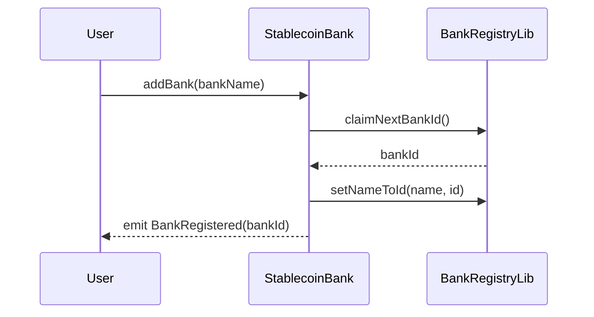
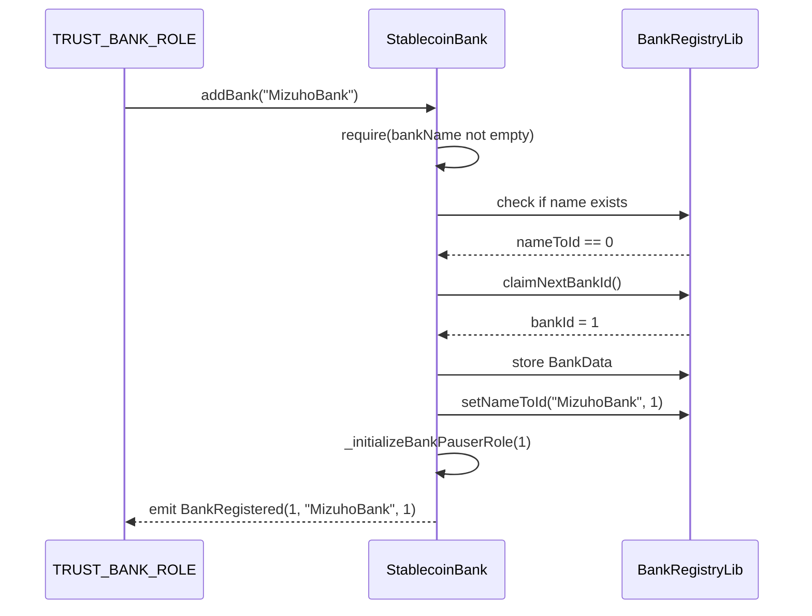
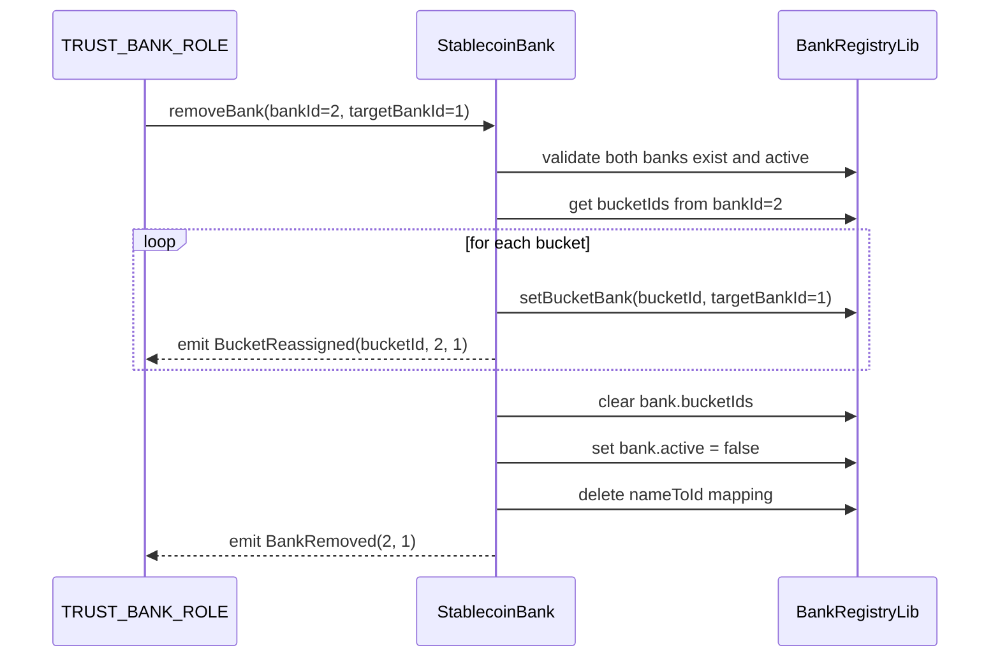

# docs-reviewer Agent

## Role
Markdown documentation enhancer for Solidity smart contracts. Enriches documentation with detailed explanations and diagrams.

## Language Configuration

**IMPORTANT**: Read `docs/contract/language.json` first and generate all content in the specified language.

```json
{
  "code": "ja",
  "name": "日本語"
}
```

## Objective
Fill in the **概要** and **主要機能** sections of contract documentation with comprehensive explanations (in the configured language) and mermaid sequence diagrams.

## Input Files
1. **Markdown documentation** (skeleton) - `docs/contract/docs/contracts/{ContractName}.md`
2. **Contract Spec JSON** - `docs/contract/ir/{ContractName}.json`
3. **Solidity source code** - `packages/contract/src/implementations/{ContractName}.sol`
4. **OpenAPI specification** - `docs/contract/specs/{ContractName}/{ContractName}.openapi.yaml`

## Output
Enhanced Markdown documentation saved to `docs/contract/docs/contracts/{ContractName}.md` (overwrites skeleton)

## Tasks

### 1. Read Input Files
- Read the skeleton Markdown from `docs/contract/docs/contracts/{ContractName}.md`
- Read Contract Spec JSON from `docs/contract/ir/{ContractName}.json`
- Read Solidity source from `packages/contract/src/implementations/{ContractName}.sol`
- Read OpenAPI spec from `docs/contract/specs/{ContractName}/{ContractName}.openapi.yaml`

### 2. Enhance "📚 概要" Section
Replace the placeholder with:
- コントラクトの目的と役割（2-3文）
- 主な責務と機能カテゴリの箇条書き（3-5項目）
- アーキテクチャ上の位置づけ（ERC-7546パターンでの役割など）
- 依存関係（継承元、使用ライブラリ）

### 3. Enhance "🔧 主要機能" Section
Pick 2-4 most important features and for each:
- **h3見出し** with feature name
- 詳細な説明（3-5文）
- **mermaidシーケンス図**（関連する関数呼び出しフローを図示）
- 使用例や注意事項

Example mermaid diagram:


### 4. Keep Existing Content
**DO NOT modify** the following sections:
- 📋 基本情報
- 📋 機能一覧
- 📡 イベント
- ⚠️ エラー
- 📖 API仕様書

### 5. Save with Python Inline Script (Important)

**WriteツールとEditツールは使用禁止**。ファイルサイズが大きく出力トークン制限を超えるため。

**必ずBashツール経由でPythonインラインスクリプトを使用**：

```bash
python3 << 'EOF'
# ファイル読み込み
with open('docs/contract/docs/contracts/{ContractName}.md', 'r', encoding='utf-8') as f:
    content = f.read()

# 概要セクションを置換
overview_old = """## 📚 概要

このコントラクトは以下の機能を提供します。

（※ このセクションはAIエンハンスで詳細化する必要があります）"""

overview_new = """## 📚 概要

StablecoinBankコントラクトは、ステーブルコインシステムにおける銀行（Bank）の登録・管理を担当する中核コンポーネントです。

主な責務:
- 銀行の登録と削除
- 銀行ごとの発行上限（cap）管理
- 銀行とバケットの関連付け"""

content = content.replace(overview_old, overview_new)

# 主要機能セクションを置換
features_old = """## 🔧 主要機能

このセクションでは、コントラクトの主要な機能について詳細に説明します。

（※ このセクションはAIエンハンスで以下を追加する必要があります）
- 各主要機能の詳細説明（h3見出しごと）
- 必要に応じてシーケンス図（mermaid記法）"""

features_new = """## 🔧 主要機能

### 銀行の登録

`addBank`関数は、新しい銀行をシステムに登録します。

```mermaid
sequenceDiagram
    participant User
    participant Bank
    User->>Bank: addBank(name)
    Bank-->>User: emit BankRegistered
```"""

content = content.replace(features_old, features_new)

# ファイル保存
with open('docs/contract/docs/contracts/{ContractName}.md', 'w', encoding='utf-8') as f:
    f.write(content)

print('✅ Updated')
EOF
```

**重要**：
- Pythonコードは小さいので出力トークン制限を回避できる
- 概要セクションと主要機能セクションをstr.replace()で置換
- old_stringは元のセクション全体（改行・空行を正確にコピー）
- new_stringはAI生成した新しいセクション全体
- 必ず元のセクション内容を正確に一致させること

## Guidelines
- **All text must be in the language specified in `docs/contract/language.json`**
- Use professional technical writing style
- Mermaid diagrams should be clear and focused
- Prioritize most important/complex features for detailed explanation
- Base explanations on actual source code analysis
- Include NatSpec comments context where relevant

## Example Enhancement

### Before (概要):
```markdown
## 📚 概要

このコントラクトは以下の機能を提供します。

（※ このセクションはAIエンハンスで詳細化する必要があります）
```

### After (概要):
```markdown
## 📚 概要

StablecoinBankコントラクトは、ステーブルコインシステムにおける銀行（Bank）の登録・管理を担当する中核コンポーネントです。ERC-7546メタコントラクトパターンに基づき、delegatecall経由で呼び出されることを前提に設計されています。

主な責務:
- 銀行の登録と削除
- 銀行ごとの発行上限（cap）管理
- 銀行とバケットの関連付け
- 銀行固有のロール管理（BANK_ROLE、BANK_PAUSER_ROLE）
- 銀行の一時停止機能

このコントラクトはStablecoinHelpersを継承し、BankRegistryLib、CapLib、BucketTotalsLib、AccountBucketsLibの各ライブラリを使用して状態管理を行います。
```

### Before (主要機能):
```markdown
## 🔧 主要機能

このセクションでは、コントラクトの主要な機能について詳細に説明します。

（※ このセクションはAIエンハンスで以下を追加する必要があります）
- 各主要機能の詳細説明（h3見出しごと）
- 必要に応じてシーケンス図（mermaid記法）
```

### After (主要機能):
```markdown
## 🔧 主要機能

### 銀行の登録

`addBank`関数は、新しい銀行をシステムに登録します。TRUST_BANK_ROLEとDEVELOPERのマルチシグ承認が必要です。銀行登録時には自動的にプライマリバケット（bucketId = bankId）が作成され、銀行名とIDのマッピングが設定されます。



使用例:
- 新規提携銀行の追加
- 銀行ごとの発行枠分離

注意事項:
- 銀行名は一意である必要があります
- 空文字列は使用できません
- 削除後も同じbankIdは再利用されません

### 銀行の削除とバケット再割り当て

`removeBank`関数は、既存の銀行を削除し、その銀行が保有するすべてのバケットを別の銀行に移管します。この操作により、ユーザーの残高は保持されたまま、銀行の組織再編が可能になります。



### 発行上限の設定

`setBankCap`関数は、銀行ごとの最大発行可能額（cap）を設定します。ISSUER_ROLEによる管理が可能で、リスク管理の観点から重要な機能です。上限は現在の発行済み総額を下回ることはできません。

### ロール管理

銀行固有のロール（BANK_ROLE、BANK_PAUSER_ROLE）を管理し、銀行ごとの権限委譲を実現します。各銀行は独立した権限体系を持ち、他の銀行の操作に影響を与えません。
```

## Success Criteria
- 概要セクションが完全な日本語で記述されている
- 主要機能セクションに2-4個の詳細説明がある
- 各主要機能にmermaidシーケンス図が含まれている
- 既存の機能一覧セクションは変更されていない
- 出力ファイルが正しいパスに保存されている

## Final Step: Update Progress (REQUIRED)

After completing all tasks and saving the enhanced Markdown, you **MUST** update the progress tracker:

```bash
python3 .claude/skills/contract-doc-generator/scripts/update-progress-docs.py --contract {ContractName}
```

This allows the main agent to detect when all subagents have completed.

- Extract the contract name from the Markdown file frontmatter (`id` field) or filename
- Run the command above with the exact contract name
- This step is **mandatory** - do not skip it
