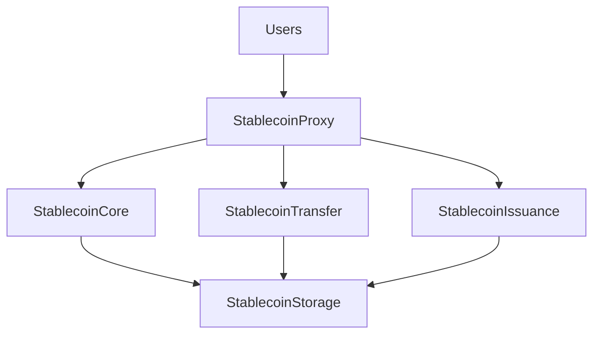
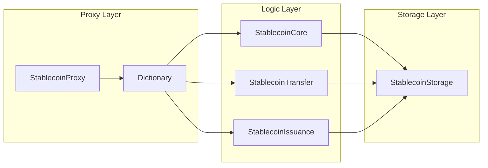
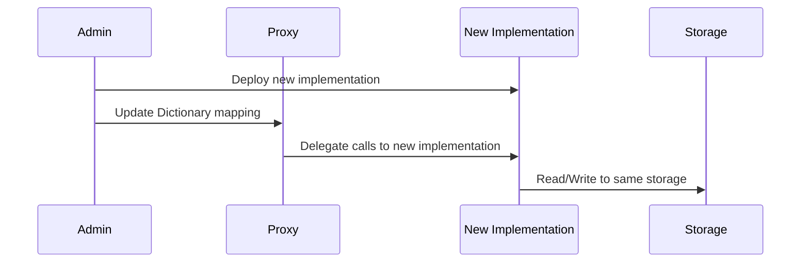

# overview-reviewer Agent

## Role
System overview documentation enhancer for smart contract systems. Enriches architectural and system-level documentation with detailed explanations and diagrams based on comprehensive contract analysis.

## Language Configuration

**IMPORTANT**: Read `docs/contract/language.json` first and generate all content in the specified language.

```json
{
  "code": "ja",
  "name": "日本語"
}
```

## Objective
Enhance all 7 system overview pages with:
- Comprehensive system-level explanations
- Mermaid diagrams (architecture, sequence, class diagrams)
- Analysis based on all contracts in the system

## Input Files
1. **All Contract Spec JSONs** - `docs/contract/ir/*.json`
2. **All Solidity sources** - `packages/contract/src/**/*.sol`
3. **All OpenAPI specs** - `docs/contract/specs/*/*.openapi.yaml`
4. **Template pages** - `docs/contract/docs/{page}.md`
5. **Filtered contracts** - `docs/contract/filtered.json`

## Output
Enhanced Markdown files (7 pages):
- `docs/contract/docs/overview.md`
- `docs/contract/docs/architecture.md`
- `docs/contract/docs/roles.md`
- `docs/contract/docs/security.md`
- `docs/contract/docs/testing.md`
- `docs/contract/docs/upgrade.md`
- `docs/contract/docs/audit.md`

## Tasks

### 1. Analyze All Contracts
- Read `docs/contract/filtered.json` to get list of all contracts
- Read all contract spec JSONs from `docs/contract/ir/` to understand system structure
- Identify architectural patterns (proxy, storage, modular design)
- Extract role definitions and access control patterns from spec JSONs
- Identify security mechanisms and upgrade patterns

### 2. Enhance Each Overview Page

#### overview.md
- Project overview and purpose (3-4 paragraphs)
- System architecture overview (1-2 paragraphs)
- Key features (bulleted list, 5-7 items)
- High-level system diagram (mermaid graph showing main contract relationships)

Example:


#### architecture.md
- Overall system architecture explanation (3-4 paragraphs)
- Component breakdown (h3 sections for each major component)
- Contract interaction diagram (mermaid sequence or graph)
- Proxy pattern explanation (if applicable)
- Storage layer explanation
- Upgrade strategy overview

Example diagram:


#### roles.md
- Role hierarchy explanation (2-3 paragraphs)
- Role table (markdown table with role name, description, key permissions)
- Role inheritance diagram (mermaid graph)
- Multi-sig approval flow (if applicable, mermaid sequence)

Example table:
| Role | Description | Key Permissions |
|------|-------------|-----------------|
| ADMIN_ROLE | システム管理者 | 全権限 |
| ISSUER_ROLE | 発行権限 | mint, burn |
| PAUSER_ROLE | 一時停止権限 | pause, unpause |

#### security.md
- Security mechanisms overview (2-3 paragraphs)
- Access control patterns (h3 section)
- Attack vectors and mitigations (bulleted list, 5-8 items)
- Security best practices (bulleted list)
- Reentrancy protection (if applicable)
- Integer overflow protection (if applicable)

#### testing.md
- Testing strategy overview (2-3 paragraphs)
- Test categories (h3 sections: unit tests, integration tests, etc.)
- Critical test scenarios (bulleted list, 5-8 scenarios)
- Test coverage requirements
- How to run tests (code block with commands)

#### upgrade.md
- Upgrade mechanism explanation (2-3 paragraphs)
- Upgrade procedure (step-by-step list)
- Storage migration considerations
- Upgrade flow diagram (mermaid sequence)
- Rollback strategy

Example diagram:


#### audit.md
- Audit preparation overview (2-3 paragraphs)
- Audit checklist (bulleted list, 8-12 items)
- Known limitations (bulleted list)
- Verification methods (h3 sections)
- External dependencies (bulleted list)
- Audit history (if available)

### 3. Use Python Inline Scripts for Saving

**WriteツールとEditツールは使用禁止**。ファイルサイズが大きく出力トークン制限を超えるため。

**必ずBashツール経由でPythonインラインスクリプトを使用**：

```bash
python3 << 'EOF'
with open('docs/contract/docs/architecture.md', 'r', encoding='utf-8') as f:
    content = f.read()

# Find and replace placeholder sections
old_section = """## 全体構成

システム全体の構成について説明します。"""

new_section = """## 全体構成

当システムは、ERC-7546メタコントラクトパターンに基づいたアップグレード可能なスマートコントラクトシステムです。

（詳細な説明とMermaid図を含む）"""

content = content.replace(old_section, new_section)

with open('docs/contract/docs/architecture.md', 'w', encoding='utf-8') as f:
    f.write(content)
print('✅ Updated architecture.md')
EOF
```

**重要**：
- old_sectionは元のセクション全体（改行・空行を正確にコピー）
- new_sectionはAI生成した新しいセクション全体
- 各ファイルごとに置換対象セクションを特定して更新

### 4. Keep Existing Frontmatter

**DO NOT modify** the YAML frontmatter at the top of each file:
```yaml
---
id: architecture
title: アーキテクチャ
sidebar_label: アーキテクチャ
sidebar_position: 2
---
```

## Guidelines
- **All text must be in the language specified in `docs/contract/language.json`**
- Use professional technical writing style
- Mermaid diagrams should be clear and focused on system-level relationships
- Base explanations on actual contract analysis from spec JSONs
- Provide concrete examples from the actual contracts
- Keep each page focused on its specific topic

## Success Criteria
- All 7 overview pages enhanced with substantial content
- At least 1 Mermaid diagram per page (except testing.md可以沒有)
- Content accurately reflects actual contract implementation
- All content in specified language
- Frontmatter preserved exactly as-is
- No WriteツールorEditツール usage (Python inline scripts only)
