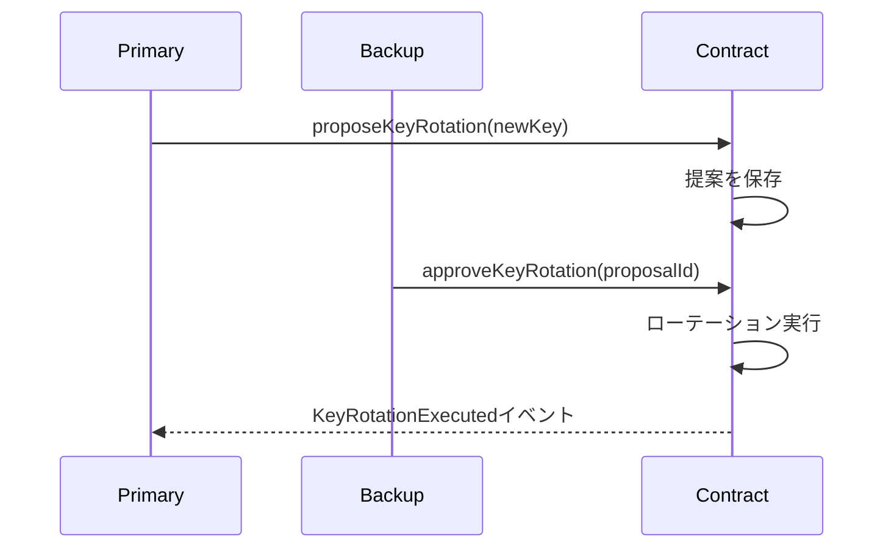

# Contract Doc Generator

## 概要

3フェーズパイプライン（テンプレート生成、AI強化、品質検証）を通じて、OpenAPI 3.0仕様書から包括的なMarkdownドキュメントを生成します。このスキルは、詳細なコントラクト概要、関数リファレンス、システム全体のドキュメントページを含むクライアント納品可能なドキュメントを作成します。

**出力**: Docusaurus用のサイドバー設定と共に、コントラクト別に整理されたMarkdownドキュメントファイル

---

## パラメータ

### 必須パラメータ（ユーザーから受け取る）

- **入力仕様書ディレクトリ**: OpenAPI仕様書が格納されているディレクトリへのパス（例: `docs/contract/specs`）
- **設定ファイルパス**: ドキュメント設定ファイル（doc-config.json）への絶対パス（例: `docs/contract/doc-config.json`）

### オプションパラメータ（デフォルト値あり、環境変数で上書き可能）

- **出力ディレクトリ**: `docs/contract/docs` (環境変数: `DOCS_DIR`)
- **フィルタリング済みコントラクトリスト**: `docs/contract/filtered.json` (環境変数: `FILTERED_JSON`)
- **検証レポート出力パス**: `docs/contract/validation-report-docs.json` (環境変数: `REPORT_PATH`)
- **テンプレートディレクトリ**: `.claude/skills/contract-doc-generator/templates/doc-generation/overview`

### ドキュメント内での変数表記

本ドキュメントでは、パスを示す際に以下の変数表記を使用します：

| 変数表記 | 説明 | デフォルト値 / 例 |
|---------|------|------------------|
| `{SPECS_DIR}` | 入力仕様書ディレクトリ（必須パラメータ） | 例: `docs/contract/specs` |
| `{DOC_CONFIG}` | 設定ファイルパス（必須パラメータ） | 例: `docs/contract/doc-config.json` |
| `{DOCS_DIR}` | 出力ディレクトリ | デフォルト: `docs/contract/docs` |
| `{FILTERED_JSON}` | フィルタリング済みコントラクトリスト | デフォルト: `docs/contract/filtered.json` |
| `{REPORT_PATH}` | 検証レポート出力パス | デフォルト: `docs/contract/validation-report-docs.json` |

**注意**: 実際のコマンド実行時には、これらの変数を実際のパスに置き換えてください。

### 環境変数の設定

以降のコマンドをそのままコピペで実行できるよう、最初に環境変数を設定します：

```bash
# ========================================
# 必須パラメータ（ユーザー環境に合わせて設定）
# ========================================
export SPECS_DIR="docs/contract/specs"
export DOC_CONFIG="docs/contract/doc-config.json"

# ========================================
# オプションパラメータ（デフォルト値、必要に応じて変更）
# ========================================
export DOCS_DIR="docs/contract/docs"
export FILTERED_JSON="docs/contract/filtered.json"
export REPORT_PATH="docs/contract/validation-report-docs.json"
```

**重要**: 上記の環境変数を設定した後、以降のコマンド例はそのままコピペで実行できます。

---

# 処理フロー

## 🚀 全体ワークフロー

完全なドキュメントの作成は4つのフェーズで構成されます：

### Phase 0: 言語設定

#### 0.1 言語設定の確認と選択

**ステップ1: 言語設定ファイルの確認**

`docs/contract/language.json` の存在を確認：

**ファイルが存在する場合**:
1. JSONを読み込み、`code`と`name`フィールドを取得
2. 「✅ 選択された言語: {name} ({code})」と表示
3. この言語コードを使用して処理を続行

**ファイルが存在しない場合**:
1. AskUserQuestionツールで言語を選択：
   - **Question**: "Select documentation language / ドキュメント生成言語を選択してください"
   - **Options**:
     - English (en) - Default
     - 日本語 (ja)
     - 한국어 (ko)
     - 简体中文 (zh-CN)

2. 選択結果を`docs/contract/language.json`に保存：
   ```json
   {
     "code": "ja",
     "name": "日本語"
   }
   ```

**重要**: 選択された言語で以降のすべての出力（画面表示、ファイル生成、ドキュメント、仕様書）を行います。

---

### フェーズ1: Markdownテンプレートの生成

#### 1.1 コントラクトドキュメントテンプレートの生成

OpenAPI仕様書からMarkdownテンプレートを作成：

```bash
python3 .claude/skills/contract-doc-generator/scripts/generate-contract-docs.py \
  --config $DOC_CONFIG \
  --specs-dir $SPECS_DIR \
  --docs-dir $DOCS_DIR
```

**処理**:
- ドキュメント設定を読み込み
- 各コントラクトに対して `generate-markdown-from-json.js` を呼び出し
- 以下のMarkdownファイルをコントラクトごとに生成:
  - `overview.md` - コントラクト概要
  - `read-functions.md` - 読み取り関数リファレンス
  - `write-functions.md` - 書き込み関数リファレンス
  - `events.md` - イベントリファレンス
  - `errors.md` - エラーリファレンス
- Docusaurusナビゲーション用の `sidebars.js` を生成

**テンプレート構造**:
生成される各テンプレートには以下が含まれます:
- セクション見出し付きの基本構造
- OpenAPIから自動生成された関数/イベント/エラーのテーブル
- プレースホルダーまたは最小限の説明
- 要素一覧用のカテゴリ別トグル

#### 1.2 システム概要ページの生成

システム全体のドキュメントテンプレートをコピー：

```bash
TEMPLATE_DIR=".claude/skills/contract-doc-generator/templates/doc-generation/overview"

cp $TEMPLATE_DIR/overview.template.md $DOCS_DIR/overview.md
cp $TEMPLATE_DIR/overview-architecture.template.md $DOCS_DIR/architecture.md
cp $TEMPLATE_DIR/overview-roles.template.md $DOCS_DIR/roles.md
cp $TEMPLATE_DIR/overview-security.template.md $DOCS_DIR/security.md
cp $TEMPLATE_DIR/overview-testing.template.md $DOCS_DIR/testing.md
cp $TEMPLATE_DIR/overview-upgrade.template.md $DOCS_DIR/upgrade.md
cp $TEMPLATE_DIR/overview-audit.template.md $DOCS_DIR/audit.md
```

**必須ページ**:
- ✅ `overview.md` - システム概要
- ✅ `architecture.md` - アーキテクチャ設計
- ✅ `roles.md` - ロール管理
- ✅ `security.md` - セキュリティ考慮事項
- ✅ `testing.md` - テストガイド
- ✅ `upgrade.md` - アップグレード手順
- ✅ `audit.md` - 監査情報

**警告**: これらのページのいずれかが欠けると、navbarリンクで404エラーが発生します。

**環境変数**（隔離テスト用オプション）:
```bash
export DOCS_DIR="temp/output/docs"
export FILTERED_JSON="temp/output/filtered.json"
```

---

### フェーズ2: AI強化（必須）

#### 2.1 docs-reviewerエージェントの呼び出し（並列実行）

包括的なドキュメントを追加するため、docs-reviewerエージェントを並列でバックグラウンド実行する。

**ステップ1: 進捗管理の初期化**

```bash
python3 .claude/skills/contract-doc-generator/scripts/init-progress-docs.py \
  --filtered-json $FILTERED_JSON \
  --output docs/contract/progress-docs.json
```

**処理**: 総コントラクト数と各コントラクトの初期状態（pending）を記録

**ステップ2: docs-reviewerエージェント並列起動**

全コントラクトに対して、docs-reviewerエージェントを起動（`language.json`から読み取った言語コードを使用）：

```bash
/docs-reviewer {language.json の code}
```

例: `/docs-reviewer ja` または `/docs-reviewer en`

**ステップ3: subagent完了時の自動処理**

各subagentは完了時に以下を自動実行します：

**3.1 進捗更新**

```bash
python3 .claude/skills/contract-doc-generator/scripts/update-progress-docs.py --contract {ContractName}
```

**処理内容**:
1. 担当コントラクトのステータスを`"completed"`に更新（`progress-docs.json`）
2. 他のコントラクトが全て完了しているか確認
3. 進捗状況を表示（例: `📊 進捗: 15/18 (残り3個)`）
4. 全完了の場合は次のフェーズに進むよう通知

**3.2 完了確認**

全subagent完了を確認：

```bash
python3 .claude/skills/contract-doc-generator/scripts/check-progress-docs.py
```

**出力例**:
- 進行中: `⏳ 進捗: 12/18 完了`
- 全完了: `✅ 全18個のコントラクトドキュメントが完了しました！`

全完了したら、次のステップ（2.2）に進む。

#### 2.2 overview-reviewerエージェントの呼び出し（1回のみ）

システム概要ページ（全7ページ）を強化するため、overview-reviewerエージェントを呼び出します。

**実行コマンド**:

```bash
/overview-reviewer {language.json の code}
```

例: `/overview-reviewer ja` または `/overview-reviewer en`

**処理対象**:
- `overview.md` - システム全体の概要
- `architecture.md` - アーキテクチャ設計
- `roles.md` - ロール管理
- `security.md` - セキュリティ設計
- `testing.md` - テスト戦略
- `upgrade.md` - アップグレード手順
- `audit.md` - 監査準備

**エージェントの処理内容**:
1. 全コントラクトの仕様書（`docs/contract/ir/*.json`）とソースコードを分析
2. システム全体のアーキテクチャパターンを抽出
3. 各概要ページのテンプレートを読み込み
4. AI生成した詳細な説明とMermaid図で強化
5. Python inline scriptsで強化されたMarkdownを保存

**注意**:
- このエージェントは**docs-reviewerと並行して実行可能**
- コントラクトドキュメントとは独立した処理のため、順序は任意
- ただし、フェーズ3に進む前に完了していることを確認

**エージェントが追加する内容**:
- コントラクトの役割と責任（2-3段落）
- h3見出しで記載された3-5個の主要機能
- 適切な機能のためのMermaid図
- セキュリティノートと制約
- 箇条書き形式の継承関係
- 充実した関数/イベント/エラーの説明
- 過剰な空白行の削除

#### 2.2 品質要件

AI強化は以下を生成する必要があります:
- ✅ 明確なコントラクトの役割と目的（2-3段落）
- ✅ 3-5個の主要機能（全関数ではなく、コア機能のみ）
- ✅ h3見出しで説明される各機能
- ✅ 適切な箇所にMermaid図
- ✅ 箇条書き形式の継承
- ✅ 連続した空白行なし（3行以上）
- ✅ クライアント納品可能な品質レベル

---

### フェーズ3: 品質検証

#### 3.1 検証スクリプトの実行

Markdownドキュメントの完全性を検証：

```bash
python3 .claude/skills/contract-doc-generator/scripts/validate-docs.py \
  --docs-dir $DOCS_DIR \
  --filtered-json $FILTERED_JSON \
  --output $REPORT_PATH
```

**処理**:
- 必須セクションの存在チェック（概要、主要機能、要素一覧）
- 過剰な空白行チェック（連続3行以上）
- 主要機能の数チェック（3-5個推奨）
- Mermaid図の存在チェック（推奨）
- 空の見出しセクションチェック

#### 3.2 検証レポートの確認

JSONレポートを確認：

```json
{
  "passed": ["StablecoinCore", "StablecoinBank"],
  "failed": [
    {
      "contract": "AccessControlMultiSig",
      "errors": [
        "必須セクション「概要」が見つかりません",
        "主要機能が1つも記述されていません（0個）"
      ],
      "warnings": [
        "Mermaid図が見つかりません",
        "主要機能の数が推奨範囲外です（2個、推奨: 3-5個）"
      ]
    }
  ],
  "warnings": [...]
}
```

**終了コード**:
- `0`: 全ての検証が合格
- `1`: 1つ以上の検証が失敗

#### 3.3 検証失敗の修正

検証が失敗した場合:
1. レポート内のエラーメッセージを確認
2. 失敗したコントラクトに対してdocs-reviewerエージェントを再呼び出し
3. 全て合格するまで検証を再実行

**全ての検証が合格した後、ドキュメントサイトの構築に進んでください。**

---

# リファレンス

## 📚 スクリプトリファレンス

### generate-contract-docs.py
**パス**: `.claude/skills/contract-doc-generator/scripts/generate-contract-docs.py`

**目的**: コントラクトドキュメント生成のメインコントローラー

**使用法**:
```bash
python3 .claude/skills/contract-doc-generator/scripts/generate-contract-docs.py \
  --config $DOC_CONFIG \
  --specs-dir $SPECS_DIR \
  --docs-dir $DOCS_DIR
```

**処理フロー**:
1. ドキュメント設定を読み込み
2. 各コントラクトに対して `generate-markdown-from-json.py` を呼び出し
3. サイドバー設定を生成
4. システム概要テンプレートをコピー

---

### generate-markdown-from-json.py
**パス**: `.claude/skills/contract-doc-generator/scripts/generate-markdown-from-json.py`

**目的**: 単一コントラクトのOpenAPI仕様書からMarkdownテンプレートを生成

**入力**: OpenAPI 3.0 YAML仕様書

**出力**: コントラクトごとに5つのMarkdownファイル
- `overview.md`
- `read-functions.md`
- `write-functions.md`
- `events.md`
- `errors.md`

**使用法**: `generate-contract-docs.py` により内部的に呼び出される

**処理**:
- OpenAPI仕様書を解析
- 関数、イベント、エラーを抽出
- Markdownテーブルを生成
- カテゴリ別トグルを作成
- プレースホルダーの説明を追加

---

### validate-docs.py
**パス**: `.claude/skills/contract-doc-generator/scripts/validate-docs.py`

**目的**: AI強化後のMarkdownドキュメント品質を検証

**使用法**:
```bash
python3 .claude/skills/contract-doc-generator/scripts/validate-docs.py \
  --docs-dir $DOCS_DIR \
  --filtered-json $FILTERED_JSON \
  --output $REPORT_PATH
```

**終了コード**:
- `0`: 全検証が合格
- `1`: 1つ以上の検証が失敗

**検証チェック項目**:
- 必須セクションの存在（概要、主要機能、要素一覧）
- 過剰な空白行なし（連続3行以上）
- 主要機能の数（3-5個推奨）
- Mermaid図の存在（推奨）
- 空の見出しセクションなし

---

## 🔧 技術詳細

### ドキュメント構造

各コントラクトは単一のMarkdownファイル（`{ContractName}.md`）として生成されます：

**生成される構造（セクション順）**:

1. **Frontmatter** - Docusaurus用メタデータ
   ```yaml
   id: ContractName
   title: Contract Title
   sidebar_label: ContractName
   ```

2. **タイトルと説明** - コントラクトの基本説明

3. **📖 API仕様書** - OpenAPI仕様書へのリンク（最優先セクション）
   - 詳細なAPI仕様リンク（`/api/{ContractName}`）

4. **📋 基本情報** - メタデータテーブル
   - コントラクト名
   - カテゴリ
   - バージョン

5. **📚 概要** - コントラクトの役割と責任
   - 2-3段落の詳細説明（AI強化で追加）
   - 継承関係（箇条書き）

6. **🔧 主要機能** - 主要機能の詳細解説
   - 3-5個の主要機能（h3見出し）
   - 各機能のMermaid図（シーケンス図、フローチャート等）
   - AI強化で追加

7. **📋 機能一覧** - 全要素の一覧（トグル形式）
   - 📝 書き込み関数（変更を伴う関数）
   - 📖 読み取り関数（view/pure関数）
   - 📡 イベント
   - ⚠️ カスタムエラー

### システム概要ページ

7つのシステム全体のドキュメントページ：

1. **overview.md** - システム概要とアーキテクチャサマリー
2. **architecture.md** - 詳細なアーキテクチャ設計
3. **roles.md** - ロール管理とアクセス制御
4. **security.md** - セキュリティ考慮事項とベストプラクティス
5. **testing.md** - テストガイドとテストカバレッジ
6. **upgrade.md** - アップグレード手順と移行ガイド
7. **audit.md** - 監査情報とレポート

### サイドバー設定

生成される `sidebars.js` の構造：

```javascript
module.exports = {
  guidesSidebar: [
    'overview',
    'architecture',
    'roles',
    'security',
    'testing',
    'upgrade',
    'audit'
  ],
  contractsSidebar: [
    {
      type: 'category',
      label: 'Core Contracts',
      items: [
        {
          type: 'category',
          label: 'StablecoinCore',
          items: [
            'contracts/StablecoinCore/overview',
            'contracts/StablecoinCore/read-functions',
            'contracts/StablecoinCore/write-functions',
            'contracts/StablecoinCore/events',
            'contracts/StablecoinCore/errors'
          ]
        }
      ]
    }
  ]
};
```

### 主要機能のガイドライン

**「主要機能」として適格なもの:**
- ✅ コントラクトの目的を定義するコア機能
- ✅ 重要なワークフローやプロセス
- ✅ 重要な状態遷移
- ✅ 重要なアクセス制御メカニズム

**主要機能に含めるべきでないもの:**
- ❌ 個別のgetter関数
- ❌ 基本的なERC20操作（コントラクトがERC20でない限り）
- ❌ シンプルなview関数
- ❌ 全ての関数（最も重要な3-5個を選択）

**主要機能の例**（StablecoinCore）:
1. 初期化とセットアップ
2. マルチシグ付きロールベースアクセス制御
3. デュアルキー管理
4. 銀行スコープ権限

### Mermaid図のガイドライン

以下の用途でMermaid図を使用：
- シーケンス図（マルチシグワークフロー、ロール提案）
- 状態図（コントラクト状態、ライフサイクル）
- フローチャート（決定木、検証フロー）

例:
````markdown
### デュアルキーローテーション


````

---

## ✅ ベストプラクティス

1. **主要機能を慎重に選択** - 全関数ではなく3-5個のコア機能を選択
2. **機能にはh3見出しを使用** - `###` 見出しで一貫した構造
3. **Mermaid図を追加** - 複雑なワークフローのための視覚的補助
4. **過剰な空白行を削除** - ドキュメントを整理
5. **継承には箇条書きを使用** - 読みやすくスキャンしやすい
6. **サイト構築前に検証** - 全てのエラーを修正、警告は許容可能
7. **システム概要ページを最新に保つ** - 7つのページ全てが存在することを確認

---

## 🔗 次のステップ

このスキルでMarkdownドキュメントを生成した後：

1. **ドキュメントサイトの構築**: `contract-site-builder` スキルを使用してDocusaurus静的サイトを作成
2. **デプロイ**: 生成された静的サイトをホスティングプラットフォームにデプロイ

**関連スキル**:
- `contract-spec-generator`: OpenAPI仕様書の生成（前提条件）
- `contract-site-builder`: Docusaurusサイトの構築とデプロイ

**関連コマンド**:
- `/generate-contract-docs`: このスキルを実行してMarkdownドキュメントを生成
