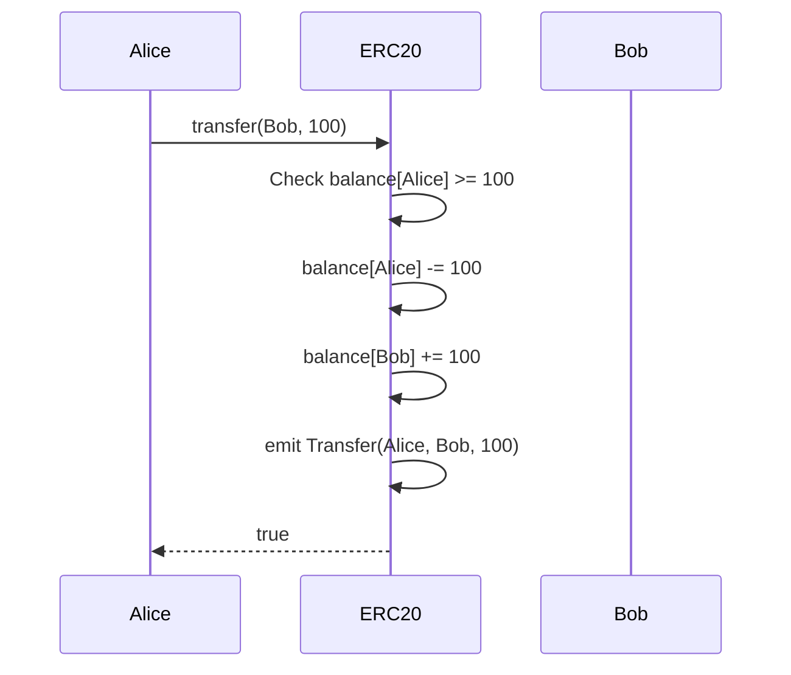
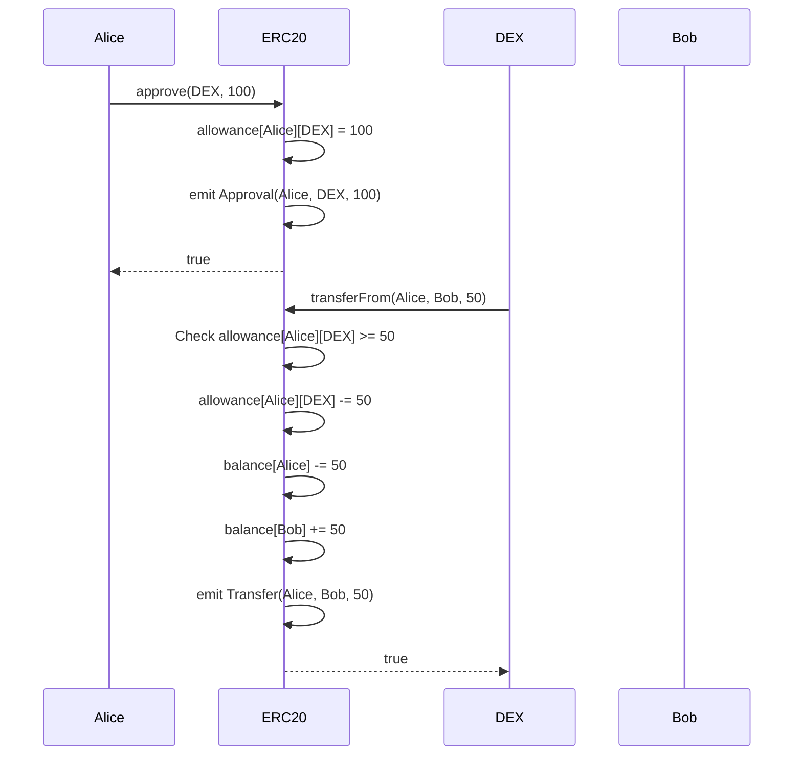
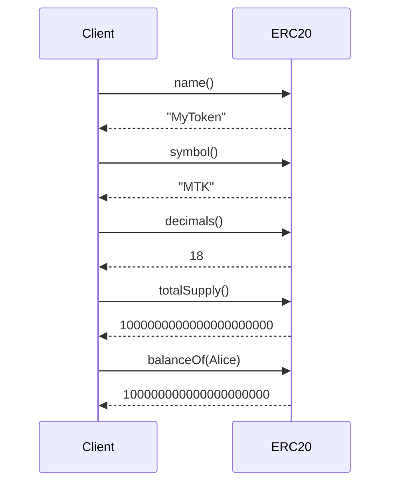

# ERC20 Solidity Interface

代替可能トークンの標準規格。転送、承認、残高照会などの基本機能を提供します。

## 基本情報

| 項目 | 内容 |
|------|------|
| コントラクト名 | ERC20 |
| カテゴリ | ERC20 トークン |
| バージョン | 1.0.0 |

## 概要

ERC20は、Ethereumブロックチェーン上で代替可能トークン(Fungible Token)を実装するための標準規格です。この規格により、異なるトークン間で統一されたインターフェイスが提供され、ウォレット、取引所、DeFiプロトコルなど、様々なアプリケーションとの相互運用性が確保されます。トークンの転送、残高照会、第三者への使用許可といった基本的な機能を提供し、すべてのERC20トークンはこの共通のインターフェイスに従うことで、エコシステム全体での統一性が保たれます。

このコントラクトは、ERC20標準で定義されたすべての必須機能を実装しています。内部的には、アカウントごとの残高管理、トークンの総供給量管理、第三者への使用許可管理などの状態を保持し、これらの状態を安全に変更するための関数を提供します。トークンの発行や焼却などの供給メカニズムは派生コントラクトで実装する必要があります。

このコントラクトは以下のコントラクトを継承しています：
- Context
- IERC20
- IERC20Metadata
- IERC20Errors

## 主要機能

### トークン転送

`transfer`関数を使用して、呼び出し元のアドレスから指定されたアドレスへトークンを直接転送できます。転送先がゼロアドレスでないこと、呼び出し元が十分な残高を持っていることが必要です。転送が成功すると`Transfer`イベントが発行され、オフチェーンアプリケーションで転送履歴を追跡できます。この機能は、ユーザー間の直接的なトークン送金や、スマートコントラクトへのトークン送付など、最も基本的なトークン移動の仕組みを提供します。

### 承認と委任転送

ERC20の重要な機能の1つは、第三者にトークン使用を許可できることです。`approve`関数で特定のアドレスに使用許可(allowance)を設定し、許可されたアドレスは`transferFrom`関数を使用してトークンを転送できます。この仕組みは、分散型取引所やDeFiプロトコルで広く使用されており、ユーザーがコントラクトにトークンの使用権限を委譲することで、自動的な取引や複雑な金融操作が可能になります。allowanceは必要最小限に設定し、無限承認を避けることがセキュリティ上推奨されます。

### 残高照会とメタデータ

トークンの状態を確認するための複数の読み取り専用関数が提供されています。`balanceOf`は特定のアドレスのトークン残高を取得し、`totalSupply`は発行済みトークンの総量を取得します。また、`name`、`symbol`、`decimals`はトークンのメタデータを提供し、ユーザーインターフェイスでの表示や、トークンの識別に使用されます。これらの関数はガスコストがかからず、いつでも呼び出し可能です。

## 要素一覧

<strong>📋 関数 (9個)</strong>

| 関数名 | 可視性 | 状態変更 | 説明 |
|--------|--------|----------|------|
| `name()` | public | view | トークンの名前を取得します。ERC20標準関数です。 |
| `symbol()` | public | view | トークンのシンボルを取得します。ERC20標準関数です。 |
| `decimals()` | public | view | トークンの小数点以下の桁数を取得します。ERC20標準関数です。通常は18です。 |
| `totalSupply()` | public | view | トークンの総供給量を取得します。ERC20標準関数です。 |
| `balanceOf(address)` | public | view | 指定されたアカウントのトークン残高を取得します。ERC20標準関数です。 |
| `allowance(address,address)` | public | view | spenderがownerから使用を許可されているトークン量を取得します。ERC20標準関数です。 |
| `transfer(address,uint256)` | public | - | 指定されたアドレスにトークンを転送します。 ERC20標準関数です。呼び出し元のアカウントから指定された宛先へトークンを移動させます。 |
| `approve(address,uint256)` | public | - | spenderが指定された量のトークンを使用することを承認します。 ERC20標準関数です。 |
| `transferFrom(address,address,uint256)` | public | - | fromからtoへトークンを転送します。事前にallowanceが設定されている必要があります。 ERC20標準関数です。呼び出し元は、事前にfromアドレスからapproveされている必要があります。allowanceが十分でない場合はエラーになります。 |

<strong>📡 イベント (2個)</strong>

| イベント名 | パラメータ | 説明 |
|-----------|-----------|------|
| `Transfer` | `address indexed from` `address indexed to` `uint256 value` | トークンが転送された時に発行されるイベントです。送金元、送金先、および転送量が記録されます。 |
| `Approval` | `address indexed owner` `address indexed spender` `uint256 value` | トークンの使用許可が設定された時に発行されるイベントです。所有者、承認された使用者、および許可量が記録されます。 |

<strong>⚠️ エラー (6個)</strong>

| エラー名 | パラメータ | 説明 |
|---------|-----------|------|
| `ERC20InvalidSender` | `address sender` | 無効な送信者アドレスが指定された時に返されるエラーです。送信者がゼロアドレスの場合に発生します。 |
| `ERC20InvalidReceiver` | `address receiver` | 無効な受信者アドレスが指定された時に返されるエラーです。受信者がゼロアドレスの場合に発生します。 |
| `ERC20InsufficientBalance` | `address sender` `uint256 balance` `uint256 needed` | 残高が不足している時に返されるエラーです。送信者の残高が転送量に満たない場合に発生します。 |
| `ERC20InvalidApprover` | `address approver` | 無効な承認者アドレスが指定された時に返されるエラーです。承認者がゼロアドレスの場合に発生します。 |
| `ERC20InvalidSpender` | `address spender` | 無効なspenderアドレスが指定された時に返されるエラーです。spenderがゼロアドレスの場合に発生します。 |
| `ERC20InsufficientAllowance` | `address spender` `uint256 allowance` `uint256 needed` | allowanceが不足している時に返されるエラーです。spenderのallowanceが転送量に満たない場合に発生します。 |

## API仕様書

詳細なAPI仕様は以下のリンクから確認できます。

[ERC20 API仕様書を見る](/api/ERC20)
