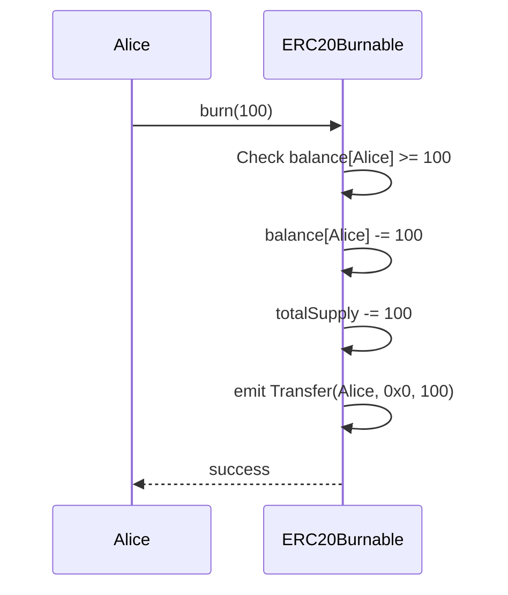
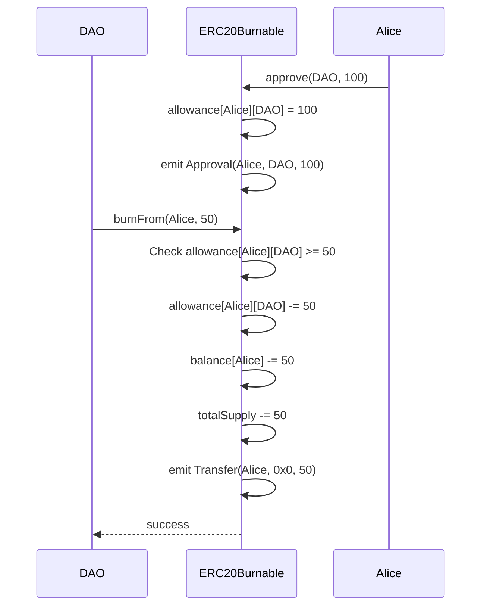

# ERC20Burnable Solidity Interface

トークン保有者が自分のトークンまたは承認されたトークンを焼却できる拡張機能。

## 基本情報

| 項目 | 内容 |
|------|------|
| コントラクト名 | ERC20Burnable |
| カテゴリ | ERC20 トークン |
| バージョン | 1.0.0 |

## 概要

ERC20Burnableは、ERC20トークンにトークン焼却(バーン)機能を追加する拡張コントラクトです。焼却とは、トークンを永久に破棄し、総供給量から削減する操作であり、デフレーショナリートークンやトークンエコノミーの調整において重要な役割を果たします。トークン保有者は自身のトークンを焼却できるだけでなく、事前に承認を得た第三者のトークンも焼却できるため、柔軟なトークン管理が可能です。

このコントラクトは、基本的なERC20機能を継承しつつ、`burn`と`burnFrom`という2つの追加関数を提供します。焼却されたトークンはゼロアドレスへの転送として処理され、Transferイベントが発行されるため、オフチェーンでの追跡が可能です。焼却操作は不可逆的であり、一度焼却されたトークンを復元することはできません。

このコントラクトは以下のコントラクトを継承しています：
- Context
- ERC20

## 主要機能

### 自己保有トークンの焼却

`burn`関数を使用して、呼び出し元が保有するトークンを焼却できます。焼却量は呼び出し元の残高以下である必要があり、焼却されたトークンは総供給量から完全に削除されます。この機能は、トークン保有者が自発的にトークンの流通量を減らしたい場合や、特定の経済モデルを実現する際に使用されます。焼却時には、送信元が呼び出し元、送信先がゼロアドレスのTransferイベントが発行されます。

### 承認されたトークンの焼却

`burnFrom`関数を使用して、事前に承認を得た他者のトークンを焼却できます。この機能は、スマートコントラクトがトークンを手数料として徴収して焼却する場合や、DAOがガバナンス決定に基づいてトークンを焼却する場合など、高度なトークン管理シナリオで使用されます。呼び出し元は、対象アカウントから十分なallowanceを得ている必要があり、焼却時にallowanceが消費されます。この操作も不可逆的であり、Transferイベントが発行されます。

## 要素一覧

<strong>📋 関数 (2個)</strong>

| 関数名 | 可視性 | 状態変更 | 説明 |
|--------|--------|----------|------|
| `burn(uint256)` | public | - | 呼び出し元のアカウントから指定された量のトークンを焼却します。 焼却されたトークンは完全に破棄され、総供給量から減少します。この操作は取り消すことができません。焼却によりTransferイベント(toがゼロアドレス)が発行され、オフチェーンで追跡可能です。 |
| `burnFrom(address,uint256)` | public | - | 指定されたアカウントから呼び出し元が承認された量のトークンを焼却します。 この関数を実行するには、呼び出し元が事前にaccountから十分なallowanceを得ている必要があります。焼却時にallowanceから該当量が差し引かれ、accountの残高から指定量が削減されます。焼却によりTransferイベント(toがゼロアドレス)が発行されます。 |

<strong>📡 イベント (1個)</strong>

| イベント名 | パラメータ | 説明 |
|-----------|-----------|------|
| `Transfer` | `address indexed from` `address indexed to` `uint256 value` | トークンが転送または焼却された時に発行されるイベントです。焼却の場合、toパラメータはゼロアドレス(0x0000000000000000000000000000000000000000)になります。 |

<strong>⚠️ エラー (3個)</strong>

| エラー名 | パラメータ | 説明 |
|---------|-----------|------|
| `ERC20InvalidSender` | `address sender` | 無効な送信者アドレスが指定された時に返されるエラーです。焼却対象のアドレスがゼロアドレスの場合に発生します。 |
| `ERC20InsufficientBalance` | `address sender` `uint256 balance` `uint256 needed` | 残高が不足している時に返されるエラーです。burn関数またはburnFrom関数で、焼却対象アカウントの残高が焼却量に満たない場合に発生します。 |
| `ERC20InsufficientAllowance` | `address spender` `uint256 allowance` `uint256 needed` | allowanceが不足している時に返されるエラーです。burnFrom関数で、呼び出し元が保有するallowanceが焼却量に満たない場合に発生します。 |

## API仕様書

詳細なAPI仕様は以下のリンクから確認できます。

[ERC20Burnable API仕様書を見る](/api/ERC20Burnable)
