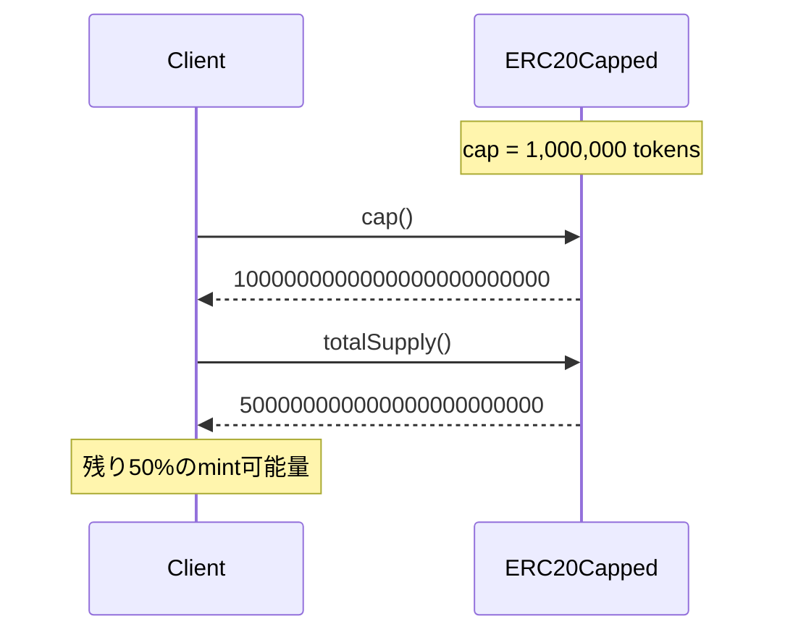
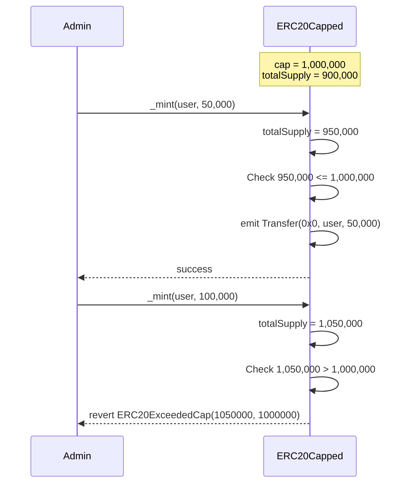

# ERC20Capped Solidity Interface

トークンの総供給量に上限を設定する拡張機能。

## 基本情報

| 項目 | 内容 |
|------|------|
| コントラクト名 | ERC20Capped |
| カテゴリ | ERC20 トークン |
| バージョン | 1.0.0 |

## 概要

ERC20Cappedは、トークンの総供給量に上限(cap)を設定する拡張コントラクトです。この上限はコンストラクタで設定され、変更不可能(immutable)であるため、デプロイ後に変更することはできません。この機能により、トークンの希少性を保証し、インフレーションを制御できます。投資家やユーザーにとって、最大供給量が明確であることは、トークンの価値評価において重要な要素となります。

新しいトークンをmintする際、総供給量が上限を超えないかがチェックされます。上限を超えるmint操作は自動的に失敗し、ERC20ExceededCapエラーが返されます。これにより、トークンの発行量を厳格に管理でき、予測可能なトークンエコノミーを構築できます。上限は0に設定できず、コンストラクタで0を指定するとERC20InvalidCapエラーで失敗します。

このコントラクトは以下のコントラクトを継承しています：
- ERC20

## 主要機能

### 上限値の照会

`cap`関数を使用して、トークンの総供給量の上限を取得できます。この値は読み取り専用で、デプロイ時にコンストラクタで設定された値が常に返されます。DAppsやウォレットは、この関数を使用してトークンの最大供給量を表示し、ユーザーに透明性を提供できます。この情報は、トークンの価値評価や投資判断において重要な指標となります。

### Mint時の上限チェック

新しいトークンをmintする際、内部的に`_update`関数が呼び出され、総供給量が上限を超えないかがチェックされます。上限を超えるmint操作は即座にERC20ExceededCapエラーで失敗します。このチェックにより、トークンの発行量が厳格に管理され、上限を超える供給量が流通することを防止します。開発者は、mint機能を実装する際、この制約を考慮する必要があります。

## 要素一覧

<strong>📋 関数 (1個)</strong>

| 関数名 | 可視性 | 状態変更 | 説明 |
|--------|--------|----------|------|
| `cap()` | public | view | トークンの総供給量の上限を取得します。 この値はコンストラクタで設定され、変更できません。総供給量がこの値を超えることはできません。 |

<strong>📡 イベント (1個)</strong>

| イベント名 | パラメータ | 説明 |
|-----------|-----------|------|
| なし | - | このコントラクト固有のイベントはありません。 |

<strong>⚠️ エラー (2個)</strong>

| エラー名 | パラメータ | 説明 |
|---------|-----------|------|
| `ERC20ExceededCap` | `uint256 increasedSupply` `uint256 cap` | 総供給量の上限を超えた時に返されるエラーです。 mint操作により総供給量がcapを超える場合に発生します。 |
| `ERC20InvalidCap` | `uint256 cap` | 無効な上限値が指定された時に返されるエラーです。 コンストラクタでcapに0が指定された場合に発生します。 |

## API仕様書

詳細なAPI仕様は以下のリンクから確認できます。

[ERC20Capped API仕様書を見る](/api/ERC20Capped)
