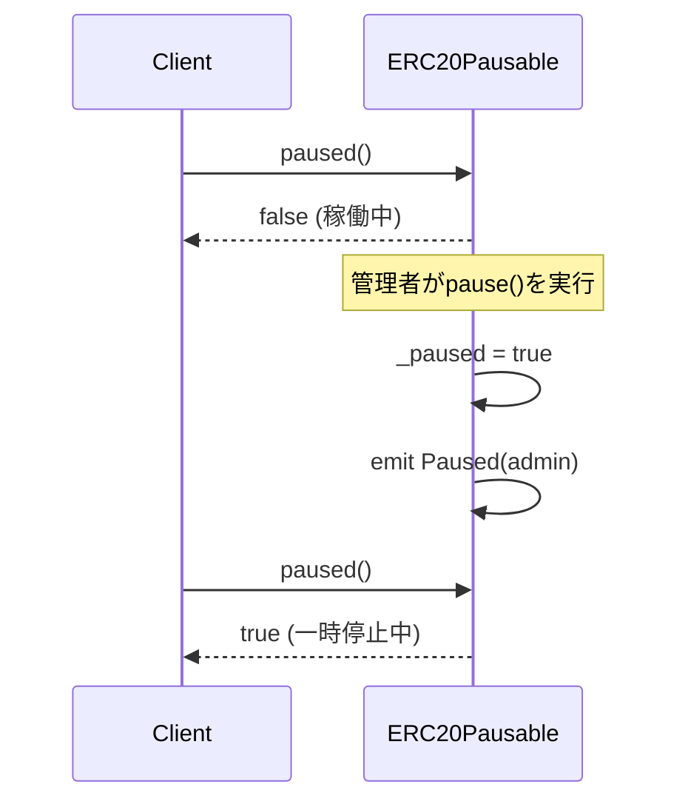
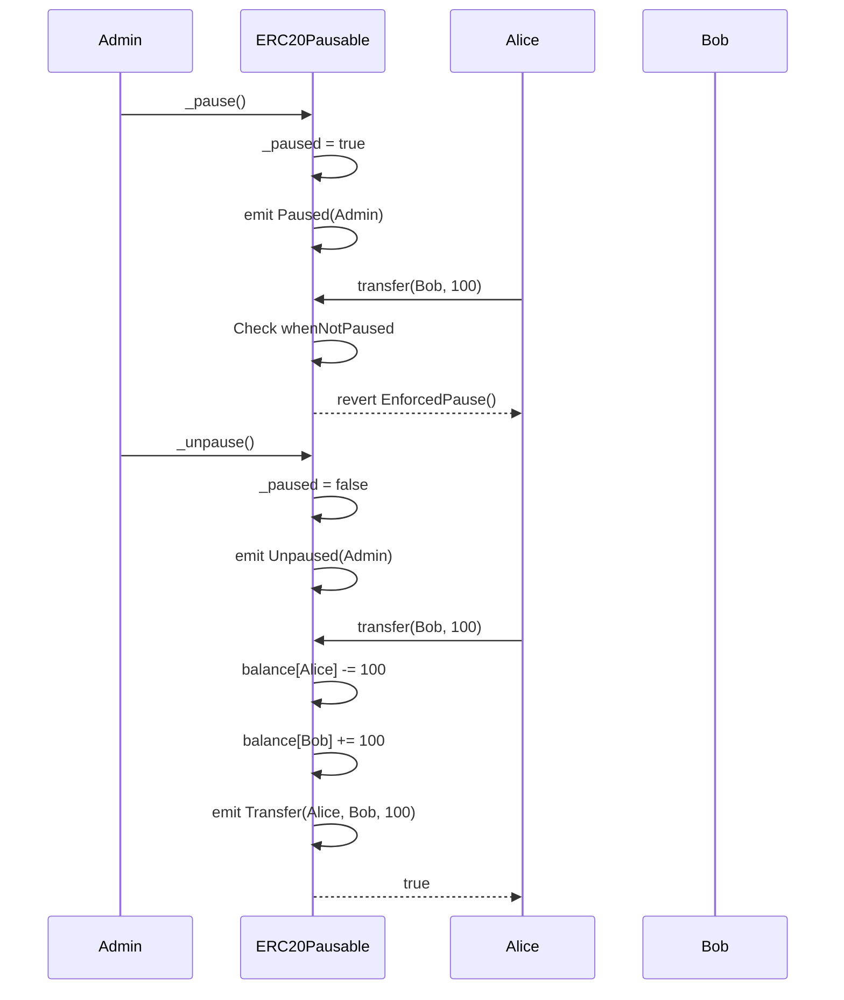

# ERC20Pausable Solidity Interface

トークンの転送、鋳造、焼却を一時停止できる拡張機能。

## 基本情報

| 項目 | 内容 |
|------|------|
| コントラクト名 | ERC20Pausable |
| カテゴリ | ERC20 トークン |
| バージョン | 1.0.0 |

## 概要

ERC20Pausableは、ERC20トークンに一時停止機能を追加する拡張コントラクトです。この機能により、管理者はトークンの転送、鋳造、焼却といったすべての状態変更操作を一時的に凍結できます。セキュリティインシデントの発生時や、スマートコントラクトのアップグレード中、評価期間中など、緊急時または計画的にトークンの動きを制御する必要がある場合に非常に有用です。

このコントラクトは、ERC20の基本機能とPausableの一時停止機能を組み合わせています。一時停止状態では、トークンの移動が完全にブロックされ、すべての転送試行がEnforcedPauseエラーで失敗します。ただし、このコントラクト自体は公開のpause/unpause関数を提供しないため、実装する際はAccessControlやOwnableなどのアクセス制御機構と組み合わせて、適切な権限管理を行う必要があります。

このコントラクトは以下のコントラクトを継承しています：
- ERC20
- Pausable

## 主要機能

### 一時停止状態の確認

`paused`関数を使用して、現在のコントラクトが一時停止状態かどうかを確認できます。この読み取り専用関数は、ガスコストなしでいつでも呼び出し可能であり、trueが返された場合はすべての転送操作が無効化されている状態を示します。ユーザーインターフェイスやスマートコントラクトは、この関数を事前にチェックすることで、無駄なトランザクションの送信を避けることができます。

### 一時停止中の転送制限

一時停止状態では、`transfer`、`transferFrom`などのすべての転送操作が自動的にブロックされます。内部的には、`_update`関数がwhenNotPausedモディファイアによって保護されており、一時停止中の呼び出しは即座にEnforcedPauseエラーで失敗します。この仕組みにより、セキュリティ上の脅威が検出された場合に、管理者は迅速にトークンの流動性を停止し、被害の拡大を防ぐことができます。

## 要素一覧

<strong>📋 関数 (1個)</strong>

| 関数名 | 可視性 | 状態変更 | 説明 |
|--------|--------|----------|------|
| `paused()` | public | view | コントラクトが一時停止状態かどうかを確認します。 一時停止状態の場合、トークンの転送、鋳造、焼却が実行できません。Pausableコントラクトから継承された関数です。 |

<strong>📡 イベント (2個)</strong>

| イベント名 | パラメータ | 説明 |
|-----------|-----------|------|
| `Paused` | `address account` | コントラクトが一時停止された時に発行されるイベントです。accountパラメータは一時停止を実行したアカウントのアドレスを示します。 |
| `Unpaused` | `address account` | コントラクトの一時停止が解除された時に発行されるイベントです。accountパラメータは一時停止解除を実行したアカウントのアドレスを示します。 |

<strong>⚠️ エラー (2個)</strong>

| エラー名 | パラメータ | 説明 |
|---------|-----------|------|
| `EnforcedPause` | なし | コントラクトが一時停止中に、一時停止中は実行できない操作が試みられた時に返されるエラーです。 transfer、transferFrom、mint、burn などの操作が一時停止中に実行されようとした場合に発生します。 |
| `ExpectedPause` | なし | コントラクトが一時停止中でない状態で、一時停止中である必要がある操作が試みられた時に返されるエラーです。 既に稼働中のコントラクトに対してunpause関数を実行しようとした場合に発生します。 |

## API仕様書

詳細なAPI仕様は以下のリンクから確認できます。

[ERC20Pausable API仕様書を見る](/api/ERC20Pausable)
