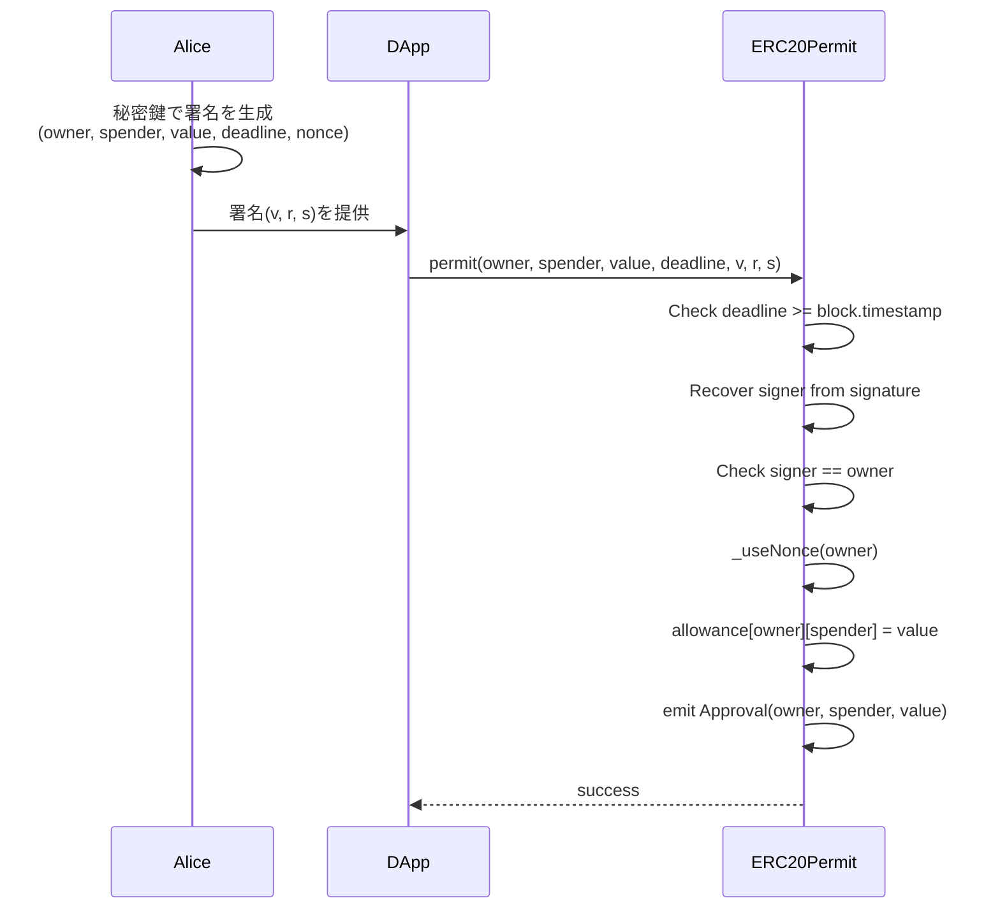
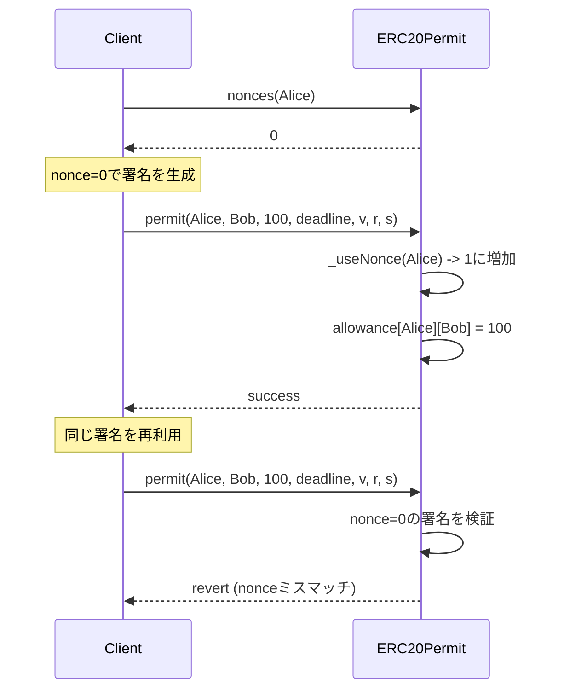
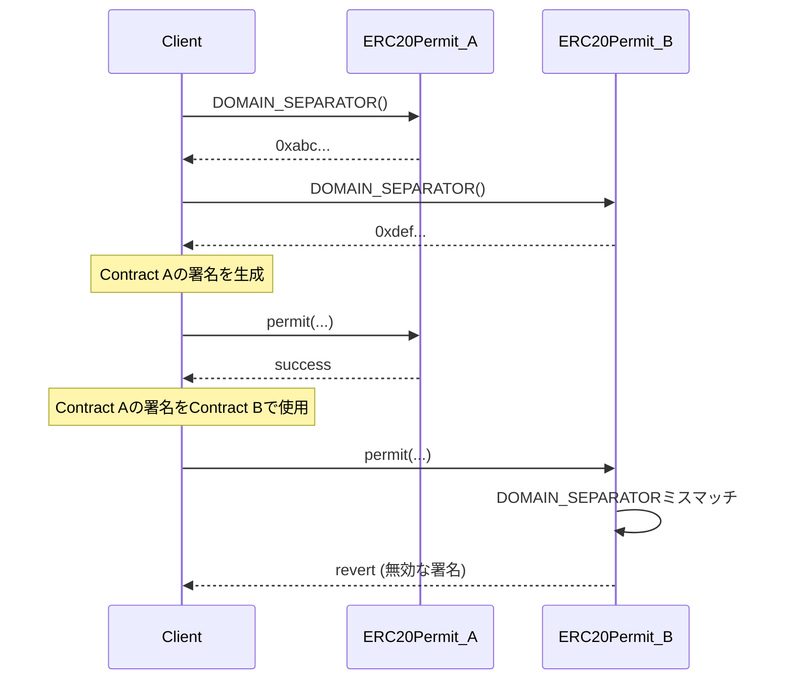

# ERC20Permit Solidity Interface

署名を使用してガスレスでトークン承認を行える拡張機能。

## 基本情報

| 項目 | 内容 |
|------|------|
| コントラクト名 | ERC20Permit |
| カテゴリ | ERC20 トークン |
| バージョン | 1.0.0 |

## 概要

ERC20Permitは、EIP-2612で定義された署名ベースの承認メカニズムを実装する拡張コントラクトです。従来のERC20では、トークンを第三者に使用させるためには、まずユーザーがapprove関数を呼び出すトランザクションを送信する必要がありました。これには、ユーザーがガス代のためにETHを保有している必要があり、また2段階のトランザクション(承認と実際の操作)が必要でした。ERC20Permitは、オフチェーンで署名を生成することで、この問題を解決します。

このコントラクトは、`permit`関数を提供し、ユーザーが秘密鍵で署名したメッセージを使用してallowanceを設定できます。署名には、所有者、spender、承認量、有効期限、nonceが含まれており、EIP-712構造化データハッシュを使用して検証されます。これにより、トークン保有者はETHを持たずにDAppsと対話でき、メタトランザクションやガスレス体験が可能になります。

このコントラクトは以下のコントラクトを継承しています：
- ERC20
- IERC20Permit
- EIP712
- Nonces

## 主要機能

### 署名ベースの承認

`permit`関数を使用して、オフチェーン署名によってallowanceを設定できます。ユーザーは、owner、spender、value、deadline、nonceを含むメッセージに署名し、その署名(v、r、s)をpermit関数に渡します。コントラクトは、ECDSA署名を検証し、署名者がownerと一致することを確認した後、allowanceを設定します。この仕組みにより、ユーザーはトランザクションを送信することなく、第三者にトークン使用権限を与えることができます。

### Nonce管理とリプレイ攻撃防止

各アカウントにはnonceが割り当てられており、permit関数を実行するたびにnonceが消費されます。これにより、同じ署名が複数回使用されるリプレイ攻撃を防止できます。`nonces`関数で現在のnonceを確認でき、署名を生成する際にこの値を使用する必要があります。nonceは単調増加するため、古い署名は無効化され、セキュリティが確保されます。

### EIP-712ドメイン分離

`DOMAIN_SEPARATOR`関数は、EIP-712で定義されたドメインセパレータを返します。このハッシュ値は、コントラクトごとに一意であり、異なるコントラクト間での署名の再利用を防ぎます。署名を生成する際には、このドメインセパレータを使用して構造化データをハッシュ化し、チェーンIDやコントラクトアドレスを含めることで、クロスチェーンリプレイ攻撃やクロスコントラクト攻撃を防止します。

## 要素一覧

<strong>📋 関数 (3個)</strong>

| 関数名 | 可視性 | 状態変更 | 説明 |
|--------|--------|----------|------|
| `permit(address,address,uint256,uint256,uint8,bytes32,bytes32)` | public | - | 署名を使用してallowanceを設定します。 この関数は、ownerが署名したメッセージを検証し、spenderに対してvalueの量のallowanceを設定します。EIP-2612標準に準拠した署名ベースの承認メカニズムです。署名の有効期限(deadline)を過ぎている場合、または署名が無効な場合はエラーになります。 |
| `nonces(address)` | public | view | 指定されたownerの現在のnonceを取得します。 nonceは、permit署名のリプレイ攻撃を防ぐために使用される値です。各permit実行時にnonceが消費され、次のpermit呼び出しでは新しいnonceを使用する必要があります。 |
| `DOMAIN_SEPARATOR()` | external | view | EIP-712ドメインセパレータを取得します。 このハッシュ値は、EIP-712署名の作成と検証に使用されます。コントラクトごとに一意の値を持ち、リプレイ攻撃を防ぎます。 |

<strong>📡 イベント (1個)</strong>

| イベント名 | パラメータ | 説明 |
|-----------|-----------|------|
| `Approval` | `address indexed owner` `address indexed spender` `uint256 value` | permit関数によってallowanceが設定された時に発行されるイベントです。ERC20のApprovalイベントと同じ形式です。 |

<strong>⚠️ エラー (2個)</strong>

| エラー名 | パラメータ | 説明 |
|---------|-----------|------|
| `ERC2612ExpiredSignature` | `uint256 deadline` | permit署名の有効期限が切れている時に返されるエラーです。 deadlineパラメータで指定された時刻よりも現在のブロックタイムスタンプが大きい場合に発生します。 |
| `ERC2612InvalidSigner` | `address signer` `address owner` | permit署名が無効または一致しない時に返されるエラーです。 署名から復元されたアドレスがownerパラメータと一致しない場合に発生します。署名パラメータ(v, r, s)が正しくない、または異なる秘密鍵で署名されている可能性があります。 |

## API仕様書

詳細なAPI仕様は以下のリンクから確認できます。

[ERC20Permit API仕様書を見る](/api/ERC20Permit)
