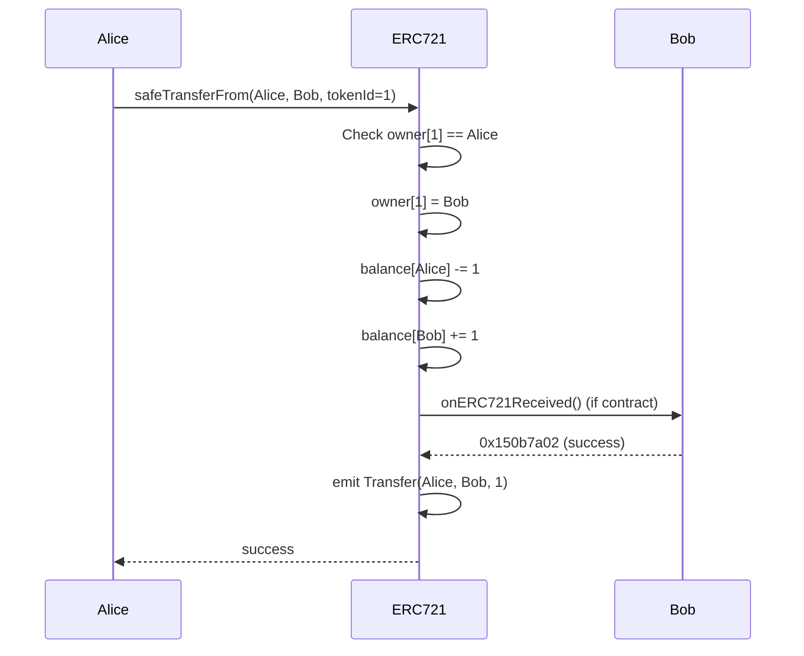
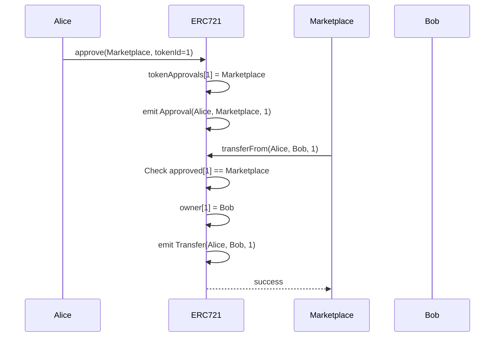
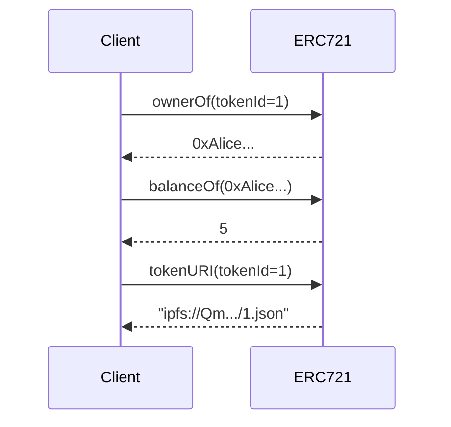

# ERC721 Solidity Interface

非代替性トークン(NFT)の標準規格。一意のデジタル資産を表現します。

## 基本情報

| 項目 | 内容 |
|------|------|
| コントラクト名 | ERC721 |
| カテゴリ | ERC721 トークン |
| バージョン | 1.0.0 |

## 概要

ERC721は、Ethereumブロックチェーン上で非代替性トークン(NFT: Non-Fungible Token)を実装するための標準規格です。各トークンは一意のトークンID を持ち、他のトークンと交換不可能です。この特性により、デジタルアート、コレクティブル、ゲームアイテム、不動産権利証など、一意性が重要なデジタル資産を表現できます。ERC721標準により、異なるNFTプロジェクト間で統一されたインターフェイスが提供され、マーケットプレイス、ウォレット、ゲームなどのエコシステム全体での相互運用性が確保されます。

このコントラクトは、所有権の移転、承認、残高照会などの基本機能を提供します。各トークンには所有者が紐づけられ、所有者は自身のトークンを他者に転送したり、第三者に転送権限を承認したりできます。また、ERC721Metadataを実装しており、各トークンに名前、シンボル、URIを設定できます。URIは、トークンのメタデータ(画像、説明など)が格納された外部リソースを指します。

このコントラクトは以下のコントラクトを継承しています：
- Context
- ERC165
- IERC721
- IERC721Metadata
- IERC721Errors

## 主要機能

### NFTの転送

`transferFrom`および`safeTransferFrom`関数を使用して、NFTを転送できます。`transferFrom`は基本的な転送を行い、`safeTransferFrom`は受信者がNFTを受け取る能力があるかを確認します。受信者がコントラクトの場合、`onERC721Received`コールバックを実装している必要があり、これによりNFTが誤って使用不可能なコントラクトに送られることを防止できます。

### 承認と委任転送

`approve`関数で特定のトークンに対する転送権限を第三者に与え、`setApprovalForAll`関数で所有するすべてのトークンに対する操作権限を与えることができます。この機能により、マーケットプレイスやオークションハウスなどの第三者サービスが、ユーザーに代わってNFTを転送できるようになります。

### 所有権と残高の照会

`ownerOf`関数で特定トークンの所有者を確認し、`balanceOf`関数で特定アドレスが保有するトークン数を取得できます。また、`tokenURI`関数でトークンのメタデータURIを取得でき、これによりNFTの画像や詳細情報にアクセスできます。

## 要素一覧

<strong>📋 関数 (11個)</strong>

| 関数名 | 可視性 | 状態変更 | 説明 |
|--------|--------|----------|------|
| `balanceOf(address)` | public | view | 指定されたアドレスが所有するトークン数を取得します。 |
| `ownerOf(uint256)` | public | view | 指定されたトークンIDの所有者アドレスを取得します。 |
| `name()` | public | view | トークンコレクションの名前を取得します。 |
| `symbol()` | public | view | トークンコレクションのシンボルを取得します。 |
| `tokenURI(uint256)` | public | view | 指定されたトークンIDのメタデータURIを取得します。 |
| `approve(address,uint256)` | public | - | 指定されたアドレスに特定トークンの転送権限を付与します。 |
| `getApproved(uint256)` | public | view | 指定されたトークンIDの承認されたアドレスを取得します。 |
| `setApprovalForAll(address,bool)` | public | - | 指定されたオペレーターに全トークンの操作権限を付与/取消します。 |
| `isApprovedForAll(address,address)` | public | view | オペレーターが所有者の全トークンを操作可能かを確認します。 |
| `transferFrom(address,address,uint256)` | public | - | トークンを転送します。 |
| `safeTransferFrom(address,address,uint256)` | public | - | 安全にトークンを転送します。受信者の確認を行います。 |

<strong>📡 イベント (3個)</strong>

| イベント名 | パラメータ | 説明 |
|-----------|-----------|------|
| `Transfer` | `address indexed from` `address indexed to` `uint256 indexed tokenId` | トークンが転送された時に発行されるイベントです。 |
| `Approval` | `address indexed owner` `address indexed approved` `uint256 indexed tokenId` | トークンの承認が設定された時に発行されるイベントです。 |
| `ApprovalForAll` | `address indexed owner` `address indexed operator` `bool approved` | 全トークンの操作権限が設定された時に発行されるイベントです。 |

<strong>⚠️ エラー (8個)</strong>

| エラー名 | パラメータ | 説明 |
|---------|-----------|------|
| `ERC721InvalidOwner` | `address owner` | 無効な所有者が指定された時に返されるエラーです。 |
| `ERC721NonexistentToken` | `uint256 tokenId` | 存在しないトークンIDが指定された時に返されるエラーです。 |
| `ERC721IncorrectOwner` | `address sender` `uint256 tokenId` `address owner` | トークンの所有者が一致しない時に返されるエラーです。 |
| `ERC721InvalidSender` | `address sender` | 無効な送信者が指定された時に返されるエラーです。 |
| `ERC721InvalidReceiver` | `address receiver` | 無効な受信者が指定された時に返されるエラーです。 |
| `ERC721InsufficientApproval` | `address operator` `uint256 tokenId` | 承認が不足している時に返されるエラーです。 |
| `ERC721InvalidApprover` | `address approver` | 無効な承認者が指定された時に返されるエラーです。 |
| `ERC721InvalidOperator` | `address operator` | 無効なオペレーターが指定された時に返されるエラーです。 |

## API仕様書

詳細なAPI仕様は以下のリンクから確認できます。

[ERC721 API仕様書を見る](/api/ERC721)
