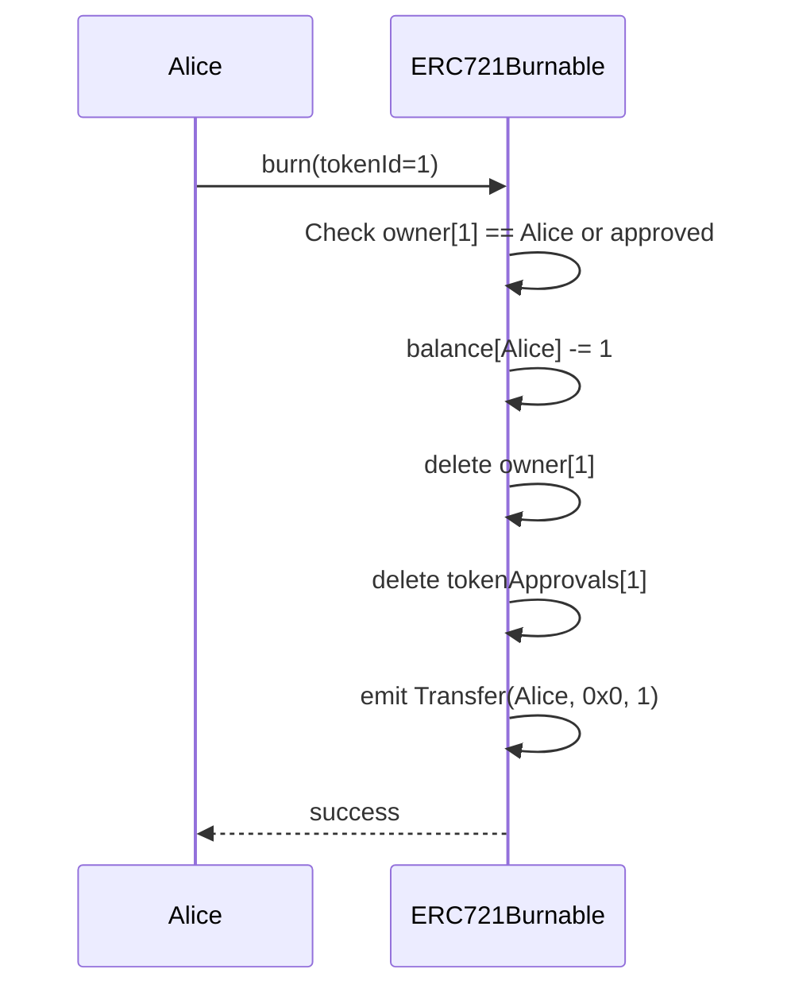
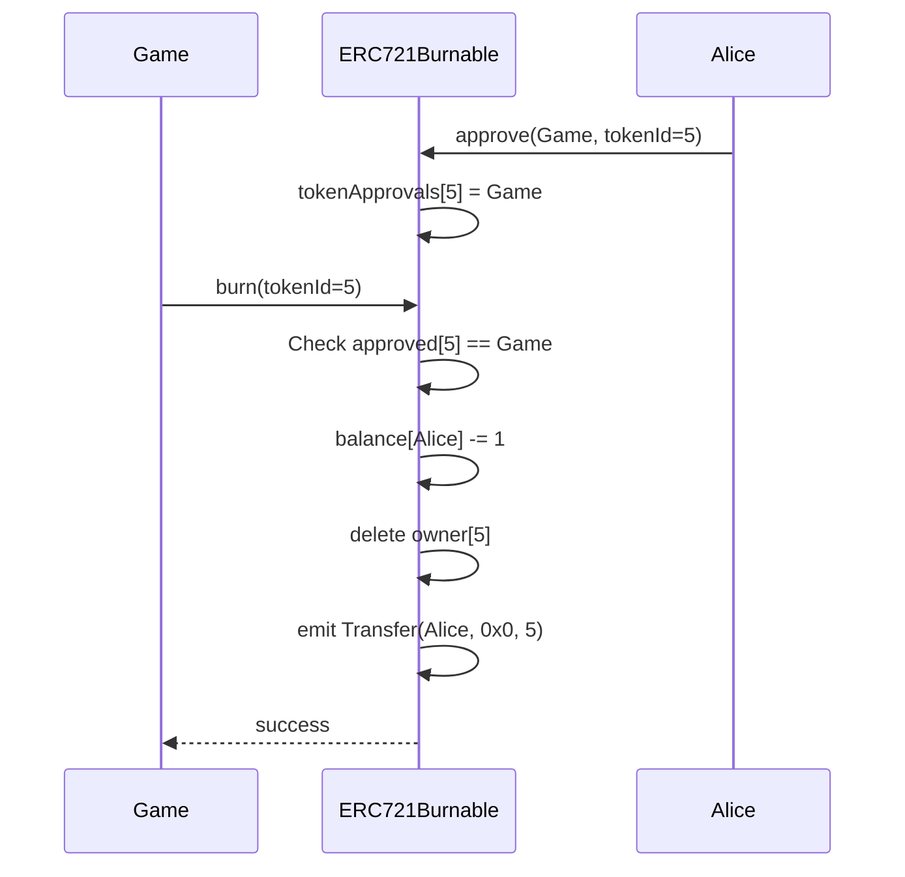

# ERC721Burnable Solidity Interface

NFT保有者が自分のトークンを焼却できる拡張機能。

## 基本情報

| 項目 | 内容 |
|------|------|
| コントラクト名 | ERC721Burnable |
| カテゴリ | ERC721 トークン |
| バージョン | 1.0.0 |

## 概要

ERC721Burnableは、ERC721トークンにNFT焼却(バーン)機能を追加する拡張コントラクトです。NFT保有者は、自身が所有するトークンまたは承認されたトークンを永久に破棄できます。焼却されたNFTは完全に消失し、復元することはできません。この機能は、ゲームアイテムの消費、不要なNFTの処分、トークンエコノミーの調整など、様々なユースケースで使用されます。

`burn`関数を呼び出すと、指定されたトークンIDのNFTが焼却されます。呼び出し元は、トークンの所有者であるか、承認されたオペレーターである必要があります。焼却時には、所有者のbalanceが減少し、トークンの所有権情報が削除されます。また、fromが所有者、toがゼロアドレスのTransferイベントが発行されるため、オフチェーンでの追跡が可能です。

このコントラクトは以下のコントラクトを継承しています：
- ERC721

## 主要機能

### NFTの焼却

`burn`関数を使用して、NFTを永久に破棄できます。呼び出し元がトークンの所有者であるか、承認されたオペレーター(approveまたはsetApprovalForAllで権限付与)である必要があります。焼却されたトークンは、総供給から削除され、二度と使用できなくなります。この操作は不可逆的であり、慎重に実行する必要があります。

### 承認されたNFTの焼却

承認されたオペレーターは、トークン所有者に代わってNFTを焼却できます。この機能は、ゲーム内でアイテムを自動的に消費するスマートコントラクトや、DAO が決定に基づいてNFTを削除する場合などに使用されます。焼却には適切な承認が必要であり、承認がない場合はエラーで失敗します。

## 要素一覧

<strong>📋 関数 (1個)</strong>

| 関数名 | 可視性 | 状態変更 | 説明 |
|--------|--------|----------|------|
| `burn(uint256)` | public | - | 指定されたトークンIDのNFTを焼却します。 呼び出し元はトークンの所有者であるか、承認されたオペレーターである必要があります。焼却されたNFTは永久に削除され、復元できません。 |

<strong>📡 イベント (1個)</strong>

| イベント名 | パラメータ | 説明 |
|-----------|-----------|------|
| `Transfer` | `address indexed from` `address indexed to` `uint256 indexed tokenId` | NFTが焼却された時に発行されるイベントです。toパラメータはゼロアドレスになります。 |

<strong>⚠️ エラー (2個)</strong>

| エラー名 | パラメータ | 説明 |
|---------|-----------|------|
| `ERC721InsufficientApproval` | `address operator` `uint256 tokenId` | 呼び出し元に焼却の権限がない時に返されるエラーです。 |
| `ERC721NonexistentToken` | `uint256 tokenId` | 存在しないトークンIDが指定された時に返されるエラーです。 |

## API仕様書

詳細なAPI仕様は以下のリンクから確認できます。

[ERC721Burnable API仕様書を見る](/api/ERC721Burnable)
