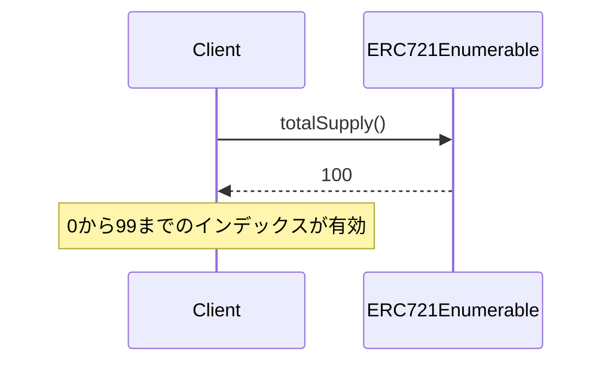
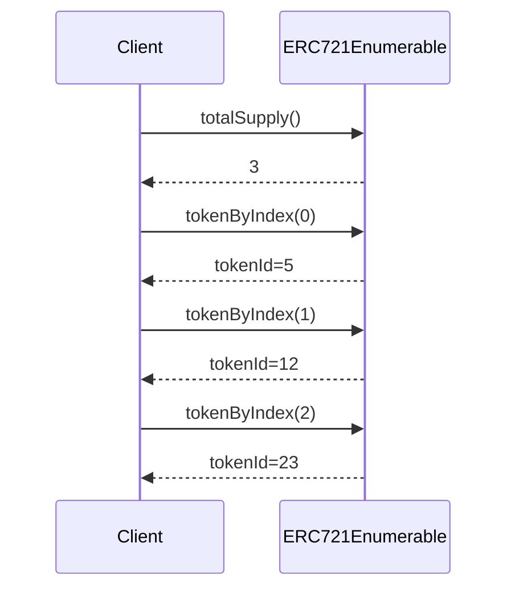
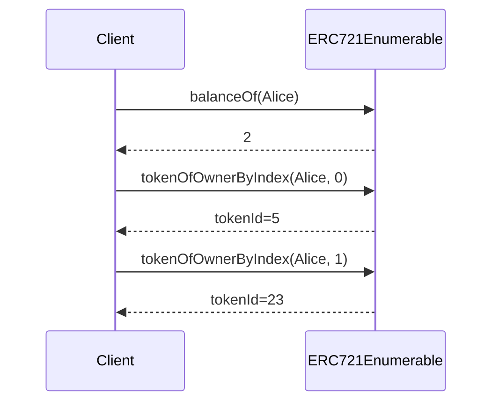

# ERC721Enumerable Solidity Interface

全トークンや所有者のトークンを列挙できる拡張機能。

## 基本情報

| 項目 | 内容 |
|------|------|
| コントラクト名 | ERC721Enumerable |
| カテゴリ | ERC721 トークン |
| バージョン | 1.0.0 |

## 概要

ERC721Enumerableは、ERC721にトークン列挙機能を追加する拡張コントラクトです。この拡張により、コントラクト内のすべてのトークンや特定所有者のトークンを順次取得できます。基本的なERC721では、トークンIDを事前に知っている必要がありましたが、この拡張により、インデックスベースでトークンをイテレートできるようになります。これは、ギャラリーアプリケーション、マーケットプレイス、ウォレットなど、複数のNFTを表示する必要があるアプリケーションで非常に有用です。

このコントラクトは、3つの主要な照会関数を提供します。`totalSupply`でコントラクト内の総トークン数を取得でき、`tokenByIndex`でグローバルインデックスからトークンIDを取得できます。また、`tokenOfOwnerByIndex`で特定所有者が保有するトークンをインデックスで取得できます。ただし、これらの機能を実現するために追加のストレージが必要であり、転送操作のガスコストが増加する点に注意が必要です。

このコントラクトは以下のコントラクトを継承しています：
- ERC721
- IERC721Enumerable

## 主要機能

### 総供給量の照会

`totalSupply`関数で、コントラクト内に存在するトークンの総数を取得できます。焼却されたトークンは含まれず、現在存在するトークンのみがカウントされます。この情報は、NFTコレクションの希少性を判断したり、全トークンを列挙する際の範囲を決定したりするのに使用されます。

### グローバルトークンの列挙

`tokenByIndex`関数を使用して、コントラクト内のすべてのトークンを順次取得できます。インデックスは0から`totalSupply() - 1`まで有効で、この範囲外のインデックスを指定するとERC721OutOfBoundsIndexエラーが返されます。この機能により、NFTマーケットプレイスはコレクション内のすべてのトークンを一覧表示できます。

### 所有者別トークンの列挙

`tokenOfOwnerByIndex`関数を使用して、特定の所有者が保有するトークンを順次取得できます。インデックスは0から`balanceOf(owner) - 1`まで有効です。この機能により、ウォレットアプリケーションはユーザーが所有するすべてのNFTを表示でき、ギャラリーアプリケーションはアーティストの全作品を一覧表示できます。

## 要素一覧

<strong>📋 関数 (3個)</strong>

| 関数名 | 可視性 | 状態変更 | 説明 |
|--------|--------|----------|------|
| `totalSupply()` | public | view | コントラクト内の総トークン数を取得します。 焼却されたトークンは含まれません。現在存在するすべてのトークンの総数です。 |
| `tokenByIndex(uint256)` | public | view | グローバルインデックスから、指定されたindexのトークンIDを取得します。 コントラクト内のすべてのトークンから、index番目のトークンIDを返します。indexがtotalSupply()以上の場合はエラーになります。 |
| `tokenOfOwnerByIndex(address,uint256)` | public | view | 指定されたownerが所有する、指定されたindexのトークンIDを取得します。 ownerが所有するトークンのリストから、index番目のトークンIDを返します。indexがbalanceOf(owner)以上の場合はエラーになります。 |

<strong>📡 イベント (1個)</strong>

| イベント名 | パラメータ | 説明 |
|-----------|-----------|------|
| なし | - | このコントラクト固有のイベントはありません。 |

<strong>⚠️ エラー (2個)</strong>

| エラー名 | パラメータ | 説明 |
|---------|-----------|------|
| `ERC721OutOfBoundsIndex` | `address owner` `uint256 index` | インデックスが範囲外の時に返されるエラーです。 tokenOfOwnerByIndexまたはtokenByIndex関数で、指定されたindexが有効範囲を超えている場合に発生します。ownerがゼロアドレスの場合、グローバルインデックスの範囲外を示します。 |
| `ERC721EnumerableForbiddenBatchMint` | なし | バッチミントが試みられた時に返されるエラーです。 ERC721Enumerableでは、バッチミント(複数トークンの同時鋳造)はサポートされていません。 |

## API仕様書

詳細なAPI仕様は以下のリンクから確認できます。

[ERC721Enumerable API仕様書を見る](/api/ERC721Enumerable)
