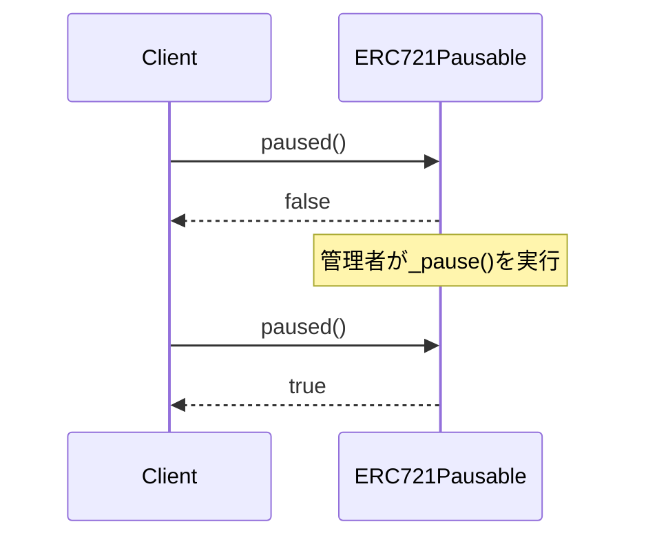
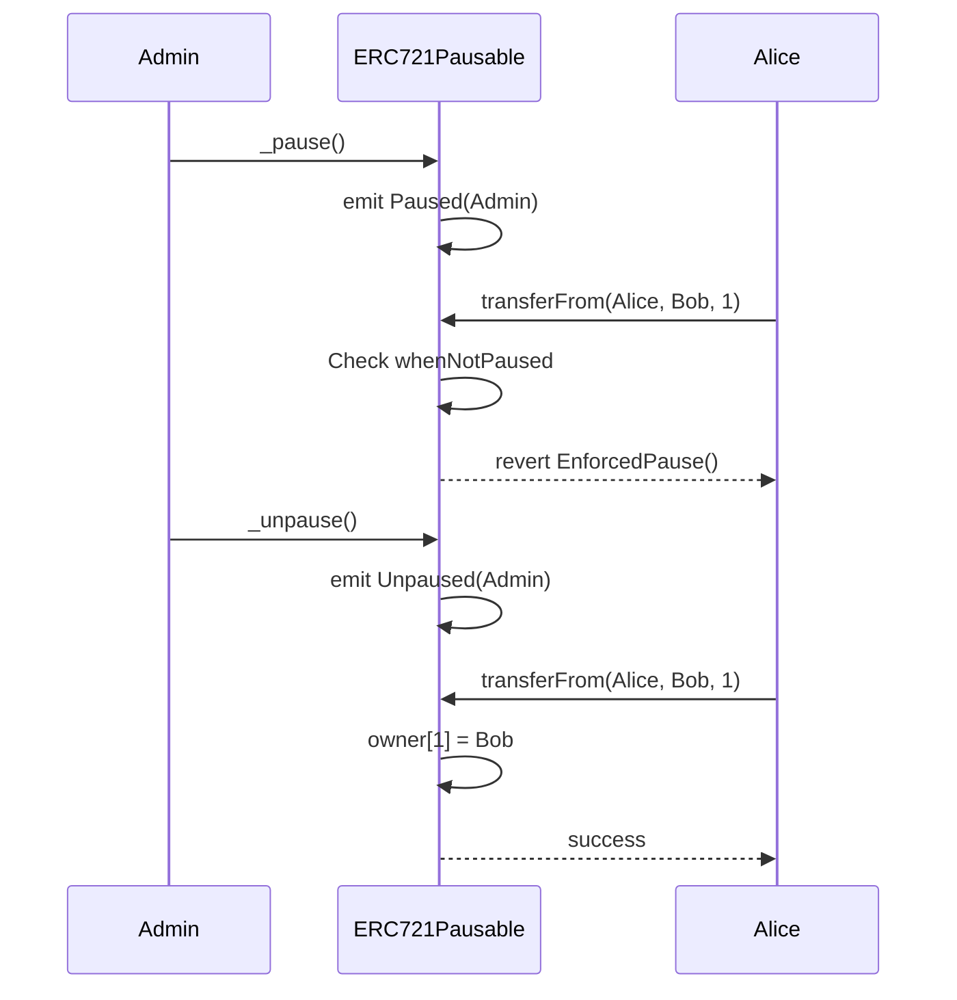

# ERC721Pausable Solidity Interface

NFTの転送を一時停止できる拡張機能。

## 基本情報

| 項目 | 内容 |
|------|------|
| コントラクト名 | ERC721Pausable |
| カテゴリ | ERC721 トークン |
| バージョン | 1.0.0 |

## 概要

ERC721Pausableは、ERC721トークンに一時停止機能を追加する拡張コントラクトです。管理者は、NFTの転送、鋳造、焼却といったすべての状態変更操作を一時的に凍結できます。セキュリティインシデントの発生時や、スマートコントラクトのアップグレード中など、緊急時にNFTの動きを制御する必要がある場合に有用です。

一時停止状態では、すべての転送操作が自動的にブロックされ、EnforcedPauseエラーで失敗します。このコントラクト自体は公開のpause/unpause関数を提供しないため、実装時にはAccessControlやOwnableなどのアクセス制御機構と組み合わせて使用する必要があります。

このコントラクトは以下のコントラクトを継承しています：
- ERC721
- Pausable

## 主要機能

### 一時停止状態の確認

`paused`関数で、現在のコントラクトが一時停止状態かどうかを確認できます。この関数はガスコストなしでいつでも呼び出し可能で、DAppsはこの情報をもとにUIを調整できます。

### 一時停止中の転送制限

一時停止状態では、`transferFrom`、`safeTransferFrom`などのすべての転送操作が拒否されます。これにより、セキュリティ上の脅威が検出された場合に、管理者は迅速にNFTの流動性を停止し、被害の拡大を防ぐことができます。

## 要素一覧

<strong>📋 関数 (1個)</strong>

| 関数名 | 可視性 | 状態変更 | 説明 |
|--------|--------|----------|------|
| `paused()` | public | view | コントラクトが一時停止状態かどうかを確認します。 一時停止状態の場合、NFTの転送、鋳造、焼却が実行できません。 |

<strong>📡 イベント (2個)</strong>

| イベント名 | パラメータ | 説明 |
|-----------|-----------|------|
| `Paused` | `address account` | コントラクトが一時停止された時に発行されるイベントです。 |
| `Unpaused` | `address account` | コントラクトの一時停止が解除された時に発行されるイベントです。 |

<strong>⚠️ エラー (2個)</strong>

| エラー名 | パラメータ | 説明 |
|---------|-----------|------|
| `EnforcedPause` | なし | 一時停止中に禁止された操作が試みられた時に返されるエラーです。 |
| `ExpectedPause` | なし | 一時停止が必要な操作が非停止状態で試みられた時に返されるエラーです。 |

## API仕様書

詳細なAPI仕様は以下のリンクから確認できます。

[ERC721Pausable API仕様書を見る](/api/ERC721Pausable)
