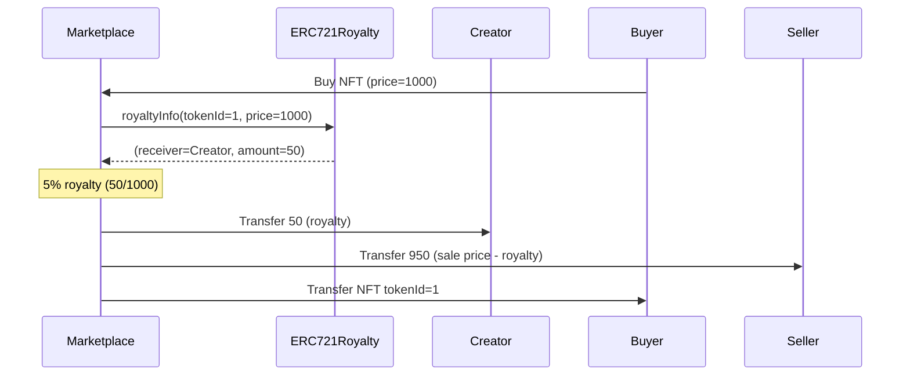
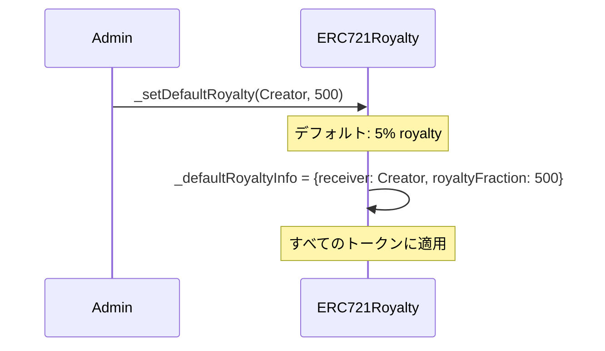

# ERC721Royalty Solidity Interface

EIP-2981準拠のNFTロイヤリティ情報を提供する拡張機能。

## 基本情報

| 項目 | 内容 |
|------|------|
| コントラクト名 | ERC721Royalty |
| カテゴリ | ERC721 トークン |
| バージョン | 1.0.0 |

## 概要

ERC721Royaltyは、EIP-2981で定義されたNFTロイヤリティ標準を実装する拡張コントラクトです。この拡張により、NFTが二次販売される際に、クリエイターや権利保有者が自動的にロイヤリティを受け取る仕組みを提供します。マーケットプレイスやオークションハウスは、`royaltyInfo`関数を呼び出して、販売価格に基づいたロイヤリティの受取人と金額を取得し、取引時に自動的にロイヤリティを支払うことができます。

このコントラクトは、デフォルトロイヤリティと個別トークンロイヤリティの2つの設定をサポートします。デフォルトロイヤリティはコレクション全体に適用され、個別トークンロイヤリティは特定のトークンにのみ適用されます。個別設定がある場合はそれが優先され、ない場合はデフォルト設定が使用されます。ロイヤリティは、販売価格のパーセンテージとして指定され、分母は10000(100%=10000)です。

このコントラクトは以下のコントラクトを継承しています：
- ERC721
- ERC2981

## 主要機能

### ロイヤリティ情報の照会

`royaltyInfo`関数を使用して、特定のトークンIDと販売価格に基づいたロイヤリティ情報を取得できます。この関数は、ロイヤリティの受取人アドレスとロイヤリティ額を返します。マーケットプレイスは、NFTの販売時にこの関数を呼び出し、返された受取人に指定された額を送信することで、クリエイターへのロイヤリティ支払いを実現します。

### デフォルトロイヤリティの設定

内部関数`_setDefaultRoyalty`を使用して、コレクション全体に適用されるデフォルトロイヤリティを設定できます。ロイヤリティは、受取人アドレスとフィー分子(分母は10000)で指定します。例えば、5%のロイヤリティを設定するには、feeNumeratorを500に設定します。この設定は、個別トークンロイヤリティが設定されていないすべてのトークンに適用されます。

## 要素一覧

<strong>📋 関数 (1個)</strong>

| 関数名 | 可視性 | 状態変更 | 説明 |
|--------|--------|----------|------|
| `royaltyInfo(uint256,uint256)` | public | view | 指定されたtokenIdと販売価格に基づいて、ロイヤリティ情報を取得します。 ERC2981標準関数です。ロイヤリティの受取人アドレスとロイヤリティ額を返します。個別のトークンロイヤリティが設定されている場合はそれが、なければデフォルトロイヤリティが使用されます。 |

<strong>📡 イベント (1個)</strong>

| イベント名 | パラメータ | 説明 |
|-----------|-----------|------|
| なし | - | このコントラクト固有のイベントはありません。 |

<strong>⚠️ エラー (4個)</strong>

| エラー名 | パラメータ | 説明 |
|---------|-----------|------|
| `ERC2981InvalidDefaultRoyalty` | `uint256 numerator` `uint256 denominator` | 無効なデフォルトロイヤリティが設定された時に返されるエラーです。 ロイヤリティ率が100%を超える場合(numerator > denominator)に発生します。 |
| `ERC2981InvalidDefaultRoyaltyReceiver` | `address receiver` | 無効なデフォルトロイヤリティ受取人が設定された時に返されるエラーです。 受取人がゼロアドレスの場合に発生します。 |
| `ERC2981InvalidTokenRoyalty` | `uint256 tokenId` `uint256 numerator` `uint256 denominator` | 無効な個別トークンロイヤリティが設定された時に返されるエラーです。 ロイヤリティ率が100%を超える場合に発生します。 |
| `ERC2981InvalidTokenRoyaltyReceiver` | `uint256 tokenId` `address receiver` | 無効な個別トークンロイヤリティ受取人が設定された時に返されるエラーです。 受取人がゼロアドレスの場合に発生します。 |

## API仕様書

詳細なAPI仕様は以下のリンクから確認できます。

[ERC721Royalty API仕様書を見る](/api/ERC721Royalty)
