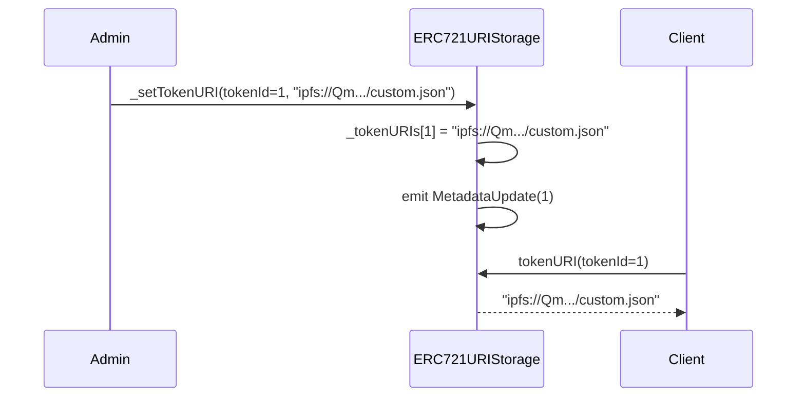
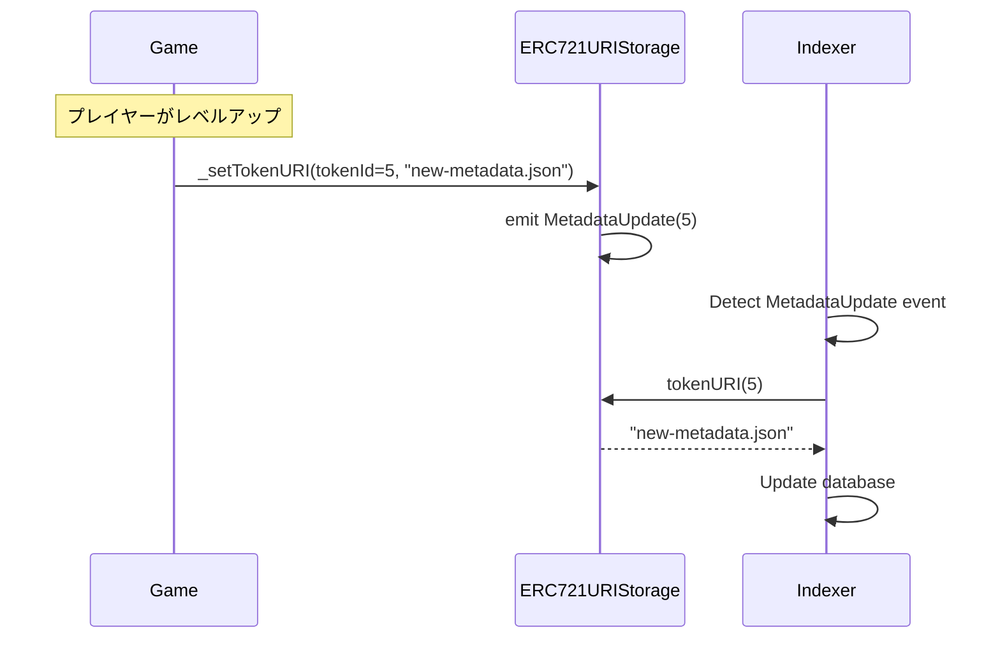

# ERC721URIStorage Solidity Interface

各トークンのメタデータURIをオンチェーンで個別管理する拡張機能。

## 基本情報

| 項目 | 内容 |
|------|------|
| コントラクト名 | ERC721URIStorage |
| カテゴリ | ERC721 トークン |
| バージョン | 1.0.0 |

## 概要

ERC721URIStorageは、各トークンのメタデータURIをオンチェーンストレージで個別に管理する拡張コントラクトです。基本的なERC721では、`tokenURI`はベースURIとトークンIDを組み合わせて生成されますが、この拡張により、各トークンに独自のURIを設定できます。これにより、トークンごとに異なるメタデータの場所を指定でき、より柔軟なNFT管理が可能になります。

この拡張は、`tokenURI`関数をオーバーライドし、個別に設定されたURIとベースURIを組み合わせて返します。個別URIが設定されていない場合は、基底クラスの実装にフォールバックします。また、EIP-4906(Metadata Update Extension)をサポートしており、URIが更新された際に`MetadataUpdate`イベントが発行され、オフチェーンアプリケーションがメタデータの変更を検出できます。

このコントラクトは以下のコントラクトを継承しています：
- ERC721
- IERC4906

## 主要機能

### 個別トークンURIの設定

内部関数`_setTokenURI`を使用して、各トークンに個別のURIを設定できます。設定されたURIは、`tokenURI`関数で取得され、個別URIが優先されます。この機能により、動的なメタデータや、トークンごとに異なるIPFSハッシュを持つNFTコレクションを実現できます。

### メタデータ更新の追跡

`_setTokenURI`が呼び出されるたびに、`MetadataUpdate`イベントが発行されます。このイベントはEIP-4906で定義されており、NFTマーケットプレイスやウォレットなどのオフチェーンアプリケーションが、メタデータの更新を検出してUIを更新できます。これにより、動的なNFT(ゲームアイテムのレベルアップなど)の状態変化をリアルタイムで反映できます。

## 要素一覧

<strong>📋 関数 (1個)</strong>

| 関数名 | 可視性 | 状態変更 | 説明 |
|--------|--------|----------|------|
| `tokenURI(uint256)` | public | view | 指定されたtokenIdのメタデータURIを取得します。 この実装は、個別に設定されたトークンURIとベースURIを組み合わせます。個別URIが設定されていない場合は、基底クラスのtokenURI実装にフォールバックします。 |

<strong>📡 イベント (1個)</strong>

| イベント名 | パラメータ | 説明 |
|-----------|-----------|------|
| `MetadataUpdate` | `uint256 tokenId` | トークンのメタデータが更新された時に発行されるイベントです。 _setTokenURI関数が呼び出されると、このイベントが発行されます。EIP-4906(ERC-721 Metadata Update Extension)で定義されています。 |

<strong>⚠️ エラー (1個)</strong>

| エラー名 | パラメータ | 説明 |
|---------|-----------|------|
| なし | - | このコントラクト固有のエラーはありません。 |

## API仕様書

詳細なAPI仕様は以下のリンクから確認できます。

[ERC721URIStorage API仕様書を見る](/api/ERC721URIStorage)
