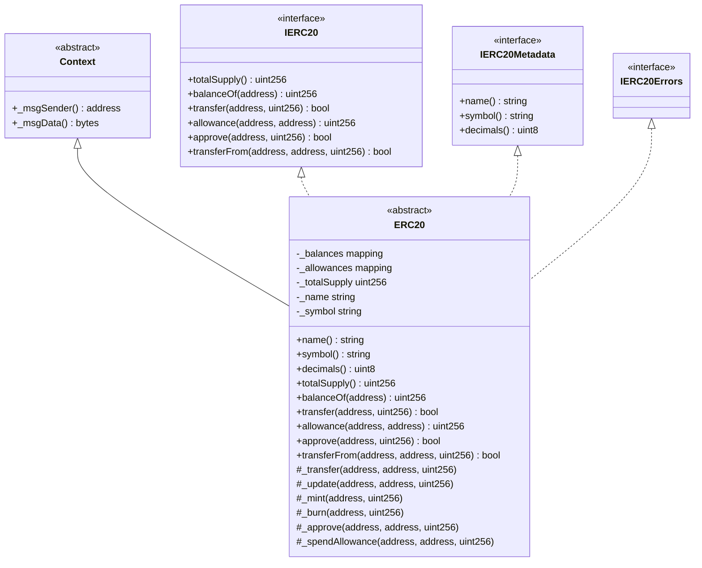
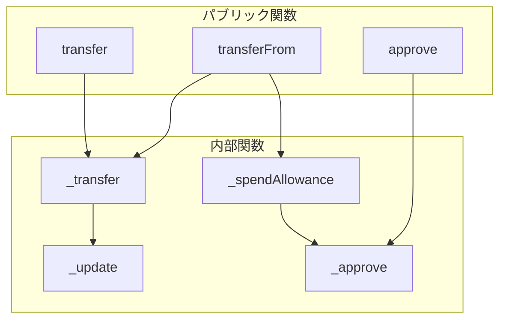

# アーキテクチャ設計

## コントラクト構造

ERC20コントラクトは、モジュラー設計に基づいて構築されています。

## 状態変数

| 変数名 | 型 | アクセス | 説明 |
|--------|-----|---------|------|
| `_balances` | `mapping(address => uint256)` | private | 各アドレスのトークン残高 |
| `_allowances` | `mapping(address => mapping(address => uint256))` | private | 所有者からspenderへの許可量 |
| `_totalSupply` | `uint256` | private | トークンの総供給量 |
| `_name` | `string` | private | トークンの名前 |
| `_symbol` | `string` | private | トークンのシンボル |

## 関数の階層

## 拡張ポイント

ERC20コントラクトは以下の関数をオーバーライドすることで拡張できます：

| 関数 | 拡張例 |
|------|--------|
| `_update` | 転送フック、手数料、ブラックリスト |
| `decimals` | カスタム小数点桁数 |
| `_approve` | カスタム許可ロジック |
