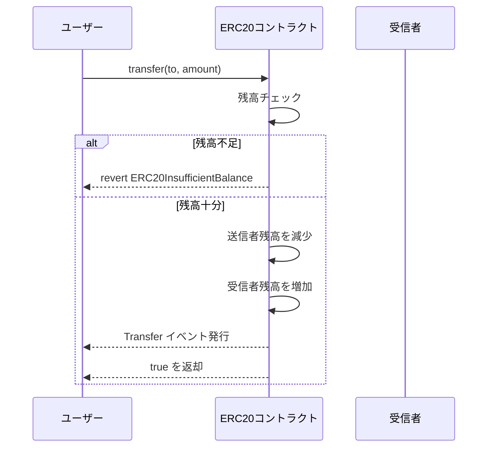
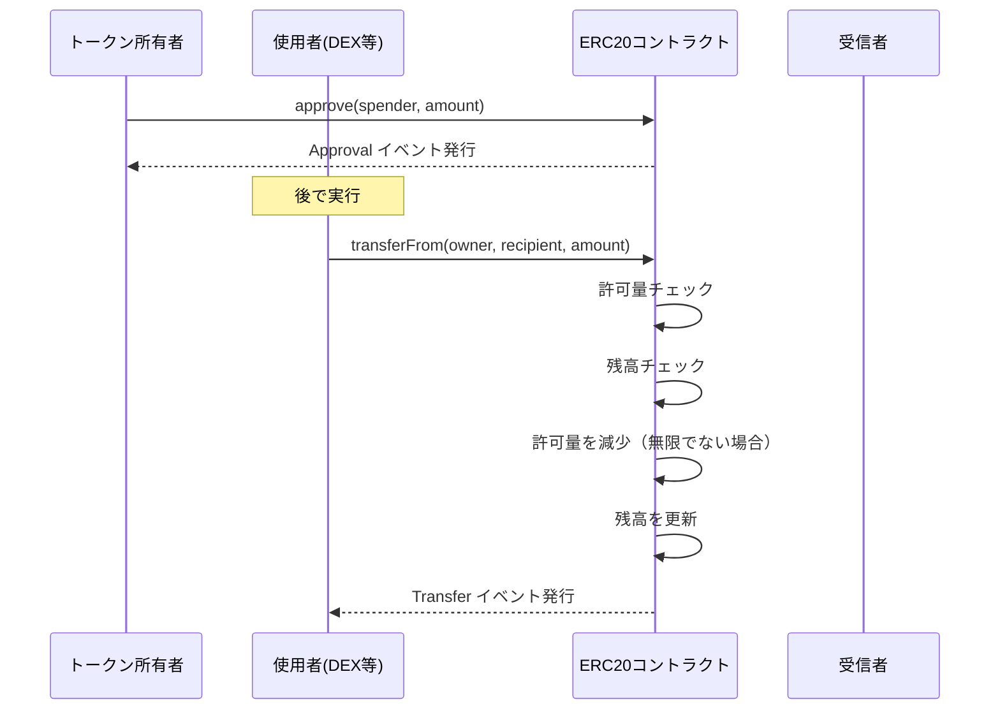
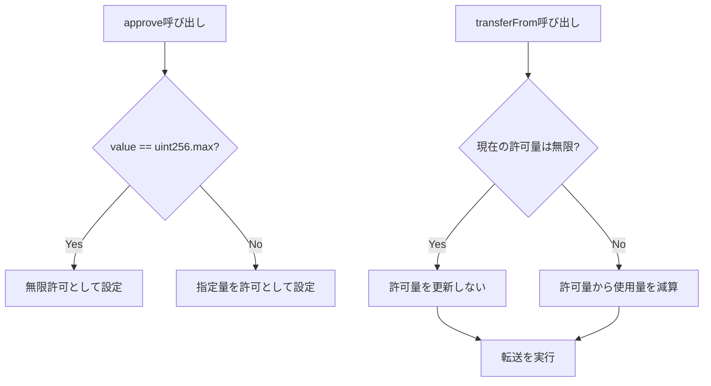

# ERC20

ERC20トークン標準の実装コントラクトです。

## 📖 API仕様書

詳細なAPI仕様は以下のリンクから確認できます：

- [ERC20 API仕様書](/docs/api/ERC20)

## 📋 基本情報

| 項目 | 値 |
|------|-----|
| コントラクト名 | ERC20 |
| カテゴリ | Token |
| バージョン | 1.0.0 |
| ライセンス | MIT |
| Solidityバージョン | ^0.8.20 |

## 📚 概要

ERC20は、Ethereumブロックチェーン上でファンジブル（代替可能）トークンを実装するための標準インターフェースです。このコントラクトはOpenZeppelin Contracts v5.4.0に基づく実装を提供します。

このコントラクトはトークンの作成方法には依存しません。つまり、供給メカニズム（ミント機能）は派生コントラクトで`_mint`関数を使用して追加する必要があります。これにより、プレセール、ICO、インフレーショナリートークンなど、さまざまなトークン経済モデルに対応できます。

デフォルトの小数点以下桁数は18で、EtherとWeiの関係を模倣しています。これにより、ほとんどのウォレットやDeFiプロトコルとの互換性が確保されます。関数は失敗時に`false`を返すのではなく`revert`するというOpenZeppelinのガイドラインに従っており、より安全で予測可能な動作を提供します。

### 継承関係

- `Context` - メッセージ送信者情報へのアクセス
- `IERC20` - ERC20標準インターフェース
- `IERC20Metadata` - 名前、シンボル、小数点桁数のメタデータ
- `IERC20Errors` - ERC-6093標準エラー

## 🔧 主要機能

### トークン転送

ERC20の最も基本的な機能として、トークンの転送があります。`transfer`関数により、トークン保有者は自身のトークンを他のアドレスに直接送付できます。

### 許可（Allowance）メカニズム

`approve`と`transferFrom`を組み合わせることで、第三者（スマートコントラクトを含む）がトークン所有者の代わりにトークンを転送できるようになります。これはDEX、レンディングプロトコル、その他のDeFiアプリケーションで広く使用されています。

### 無限許可（Infinite Approval）

`approve`関数でvalueに`type(uint256).max`を設定すると、無限の許可を与えることができます。この場合、`transferFrom`での使用時に許可量は減少しません。これはガス効率を向上させますが、信頼できるコントラクトにのみ使用すべきです。

### トークンメタデータ

`name`、`symbol`、`decimals`関数により、トークンのメタデータを取得できます。これらの値はコンストラクタで設定され、デプロイ後は変更できません。

| 関数 | 戻り値 | 説明 |
|------|--------|------|
| `name()` | string | トークンの完全な名前（例: "My Token"） |
| `symbol()` | string | トークンのシンボル（例: "MTK"） |
| `decimals()` | uint8 | 小数点以下桁数（デフォルト: 18） |

## 📋 機能一覧

### 📖 読み取り関数

読み取り関数一覧を表示

| 関数名 | 説明 |
|--------|------|
| `name()` | トークンの名前を返します |
| `symbol()` | トークンのシンボル（通常は名前の短縮版）を返します |
| `decimals()` | ユーザー表示用の小数点以下桁数を返します（デフォルト: 18） |
| `totalSupply()` | 存在するトークンの総量を返します |
| `balanceOf(address account)` | 指定されたアドレスが所有するトークン量を返します |
| `allowance(address owner, address spender)` | spenderがownerの代わりに使用できる残りのトークン量を返します |

### 📝 書き込み関数

書き込み関数一覧を表示

| 関数名 | 説明 |
|--------|------|
| `transfer(address to, uint256 value)` | 呼び出し元のアカウントから指定されたアドレスへトークンを送付します |
| `approve(address spender, uint256 value)` | spenderに対して呼び出し元のトークンからvalueを使用する許可を与えます |
| `transferFrom(address from, address to, uint256 value)` | 許可メカニズムを使用して、fromからtoへトークンを送付します |

### 📡 イベント

イベント一覧を表示

| イベント名 | 説明 |
|------------|------|
| `Transfer(address indexed from, address indexed to, uint256 value)` | トークンが転送されたときに発行されます。ゼロ値の転送も含みます。ミント時はfromがゼロアドレス、バーン時はtoがゼロアドレスになります。 |
| `Approval(address indexed owner, address indexed spender, uint256 value)` | ownerのspenderに対する許可量が設定されたときに発行されます。valueは新しい許可量です。 |

### ⚠️ カスタムエラー

エラー一覧を表示

| エラー名 | 説明 |
|----------|------|
| `ERC20InsufficientAllowance(address spender, uint256 allowance, uint256 needed)` | spenderの許可量が必要な量より少ない場合に発生します |
| `ERC20InsufficientBalance(address sender, uint256 balance, uint256 needed)` | senderの残高が必要な量より少ない場合に発生します |
| `ERC20InvalidApprover(address approver)` | 承認者（owner）がゼロアドレスの場合に発生します |
| `ERC20InvalidReceiver(address receiver)` | 送付先がゼロアドレスの場合に発生します |
| `ERC20InvalidSender(address sender)` | 送付元がゼロアドレスの場合に発生します |
| `ERC20InvalidSpender(address spender)` | spenderがゼロアドレスの場合に発生します |

## 🔒 セキュリティ考慮事項

### 許可の競合状態（Race Condition）

`approve`関数には既知の競合状態の問題があります。所有者が許可量を変更する際、悪意のあるspenderが古い許可と新しい許可の両方を使用する可能性があります。

**推奨対策:**
1. 許可量を変更する前に、まず0に設定する
2. `increaseAllowance`/`decreaseAllowance`パターンを使用する（OpenZeppelin拡張）

### ゼロアドレスへの転送

このコントラクトはゼロアドレスへの転送を禁止しています。トークンをバーンする場合は、内部の`_burn`関数を使用する派生コントラクトを実装する必要があります。

### 整数オーバーフロー

Solidity 0.8.0以降では算術演算にオーバーフロー保護が組み込まれていますが、`unchecked`ブロック内の操作は保護されません。このコントラクトでは、オーバーフローが不可能であることが証明されている場合にのみ`unchecked`を使用しています。
