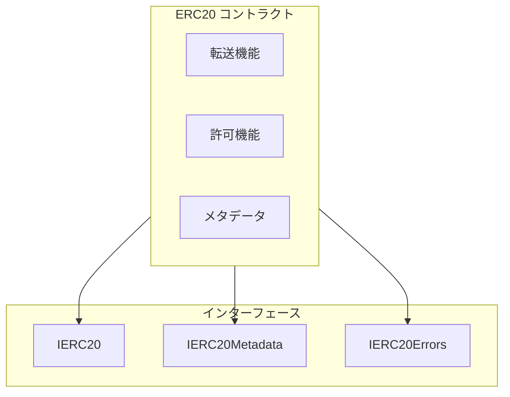

# システム概要

## はじめに

このドキュメントは、OpenZeppelin ERC20トークン標準の実装に関する包括的なリファレンスを提供します。

## コントラクト一覧

| コントラクト名 | カテゴリ | 説明 |
|---------------|---------|------|
| [ERC20](/docs/contracts/ERC20/) | Token | ERC20トークン標準の実装 |

## アーキテクチャ概要



## クイックスタート

### トークンのデプロイ

ERC20コントラクトは抽象コントラクトであるため、派生コントラクトを作成する必要があります：

```solidity
// SPDX-License-Identifier: MIT
pragma solidity ^0.8.20;

import "@openzeppelin/contracts/token/ERC20/ERC20.sol";

contract MyToken is ERC20 {
    constructor() ERC20("My Token", "MTK") {
        _mint(msg.sender, 1000000 * 10 ** decimals());
    }
}
```

### 基本的な操作

```solidity
// 残高確認
uint256 balance = token.balanceOf(address);

// トークン転送
token.transfer(recipient, amount);

// 許可の設定
token.approve(spender, amount);

// 許可を使用した転送
token.transferFrom(from, to, amount);
```

## 次のステップ

- [アーキテクチャ詳細](./architecture) - 詳細なアーキテクチャ設計
- [セキュリティ](./security) - セキュリティ考慮事項
- [ERC20リファレンス](/docs/contracts/ERC20/) - 詳細なAPI仕様
