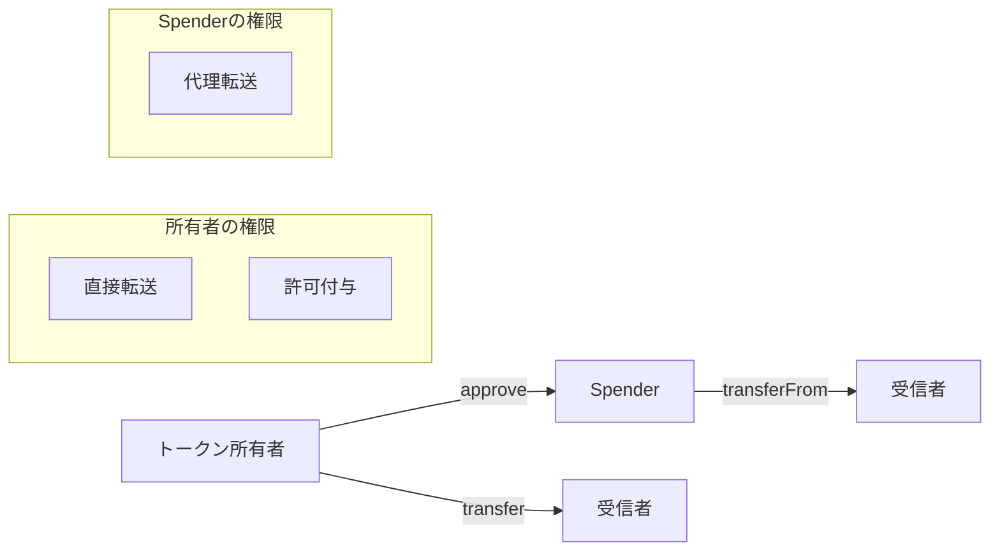

# ロール管理

## 概要

ERC20標準コントラクトは、基本的なロール管理機能を持ちません。全てのトークン保有者は同等の権限を持ち、自身のトークンに対してのみ操作が可能です。

## 暗黙的なロール

### トークン保有者

トークンを保有するアドレスは、以下の権限を持ちます：

| 権限 | 説明 |
|------|------|
| 転送 | 自身のトークンを他のアドレスに転送 |
| 許可付与 | 他のアドレスに自身のトークンの使用許可を付与 |
| 残高確認 | 任意のアドレスの残高を確認 |

### Spender（使用許可者）

`approve`関数により許可を受けたアドレスは、以下の権限を持ちます：

| 権限 | 説明 |
|------|------|
| 代理転送 | 許可量の範囲内で所有者のトークンを転送 |
| 許可確認 | 自身に付与された許可量を確認 |

## 権限フロー



## 拡張されたロール管理

より高度なロール管理が必要な場合は、以下のOpenZeppelin拡張を検討してください：

| 拡張コントラクト | 用途 |
|-----------------|------|
| `Ownable` | 単一の管理者 |
| `AccessControl` | ロールベースアクセス制御 |
| `AccessControlEnumerable` | 列挙可能なロール管理 |

### 例: ミント権限の追加

```solidity
import "@openzeppelin/contracts/access/Ownable.sol";

contract MyToken is ERC20, Ownable {
    constructor() ERC20("My Token", "MTK") Ownable(msg.sender) {}

    function mint(address to, uint256 amount) public onlyOwner {
        _mint(to, amount);
    }
}
```
