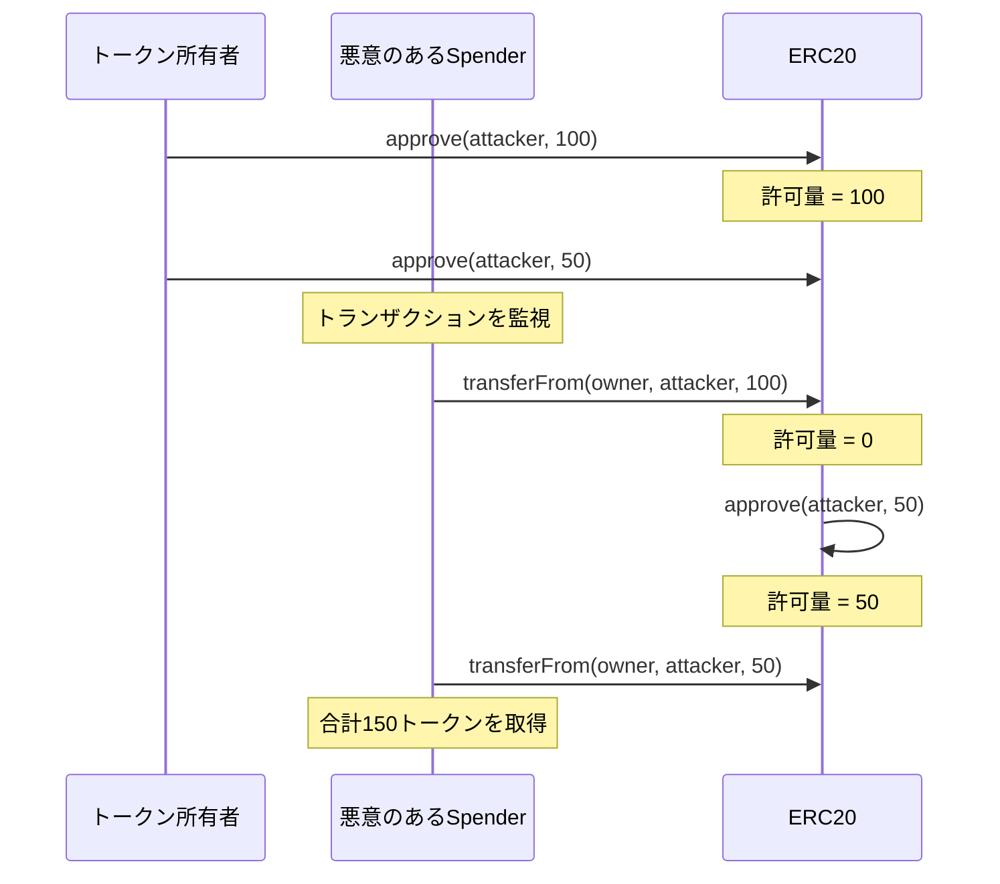

# セキュリティ考慮事項

## 既知の問題と対策

### 1. 許可の競合状態（Approve Race Condition）

**問題:**
`approve`関数で許可量を変更する際、悪意のあるspenderが古い許可と新しい許可の両方を使用する可能性があります。



**対策:**
```solidity
// 許可量を変更する前に0に設定
token.approve(spender, 0);
token.approve(spender, newAmount);

// または、increaseAllowance/decreaseAllowanceを使用
token.increaseAllowance(spender, additionalAmount);
token.decreaseAllowance(spender, subtractedAmount);
```

### 2. ゼロアドレスへの転送

**問題:**
ゼロアドレスへの転送は実質的にトークンのバーンですが、意図しない操作の可能性があります。

**対策:**
このコントラクトでは、`ERC20InvalidReceiver`エラーによりゼロアドレスへの転送を禁止しています。

### 3. 整数オーバーフロー

**問題:**
残高や許可量の計算でオーバーフローが発生する可能性があります。

**対策:**
- Solidity 0.8.0以降の組み込みオーバーフロー保護
- `unchecked`ブロックは安全性が証明された箇所でのみ使用

## セキュリティベストプラクティス

### スマートコントラクト開発者向け

1. **許可量の管理**
   - 無限許可（`type(uint256).max`）は信頼できるコントラクトにのみ使用
   - 定期的に許可量を確認・リセット

2. **転送前の検証**
   - 受信者アドレスの有効性を確認
   - 十分な残高があることを確認

3. **イベントの監視**
   - `Transfer`と`Approval`イベントを監視してフロントランニング攻撃を検出

### ユーザー向け

1. **許可の最小化**
   - 必要最小限の許可量のみを設定
   - 使用後は許可を取り消す

2. **コントラクトの検証**
   - 許可を与える前にコントラクトのソースコードを確認
   - 監査済みのプロトコルを優先

## 監査チェックリスト

- [ ] ゼロアドレスチェック
- [ ] オーバーフロー保護
- [ ] アクセス制御の適切な実装
- [ ] イベントの正しい発行
- [ ] リエントランシー保護（必要な場合）
