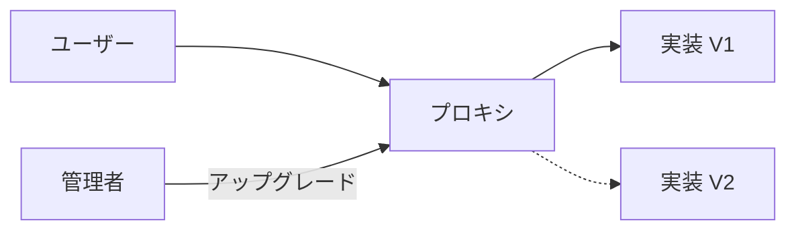
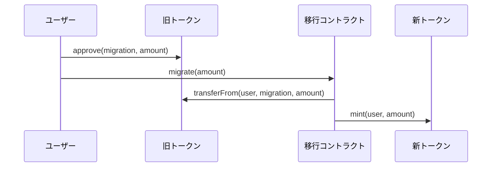

# アップグレード手順

## 概要

標準のERC20コントラクトはアップグレード不可能です。デプロイ後にコードを変更することはできません。

## アップグレード可能なERC20

アップグレード機能が必要な場合は、OpenZeppelinのアップグレード可能なコントラクトを使用してください。

### プロキシパターン



### 使用方法

```solidity
// SPDX-License-Identifier: MIT
pragma solidity ^0.8.20;

import "@openzeppelin/contracts-upgradeable/token/ERC20/ERC20Upgradeable.sol";
import "@openzeppelin/contracts-upgradeable/proxy/utils/Initializable.sol";
import "@openzeppelin/contracts-upgradeable/proxy/utils/UUPSUpgradeable.sol";

contract MyTokenV1 is Initializable, ERC20Upgradeable, UUPSUpgradeable {
    /// @custom:oz-upgrades-unsafe-allow constructor
    constructor() {
        _disableInitializers();
    }

    function initialize() initializer public {
        __ERC20_init("My Token", "MTK");
        __UUPSUpgradeable_init();
    }

    function _authorizeUpgrade(address newImplementation)
        internal
        override
        onlyOwner
    {}
}
```

## アップグレード時の注意点

### ストレージレイアウト

アップグレード時には、ストレージレイアウトの互換性を維持する必要があります。

| 注意点 | 説明 |
|--------|------|
| 変数の順序 | 既存の変数の順序を変更しない |
| 変数の削除 | 既存の変数を削除しない |
| 変数の型 | 既存の変数の型を変更しない |
| 新規変数 | 新しい変数は末尾に追加 |

### 初期化関数

アップグレード可能なコントラクトでは、コンストラクタの代わりに`initialize`関数を使用します。

```solidity
// 誤り: コンストラクタは実行されない
constructor() {
    _name = "My Token";
}

// 正しい: initialize関数を使用
function initialize() public initializer {
    __ERC20_init("My Token", "MTK");
}
```

## 移行ガイド

### 既存トークンからの移行

既存のERC20トークンをアップグレード可能なバージョンに移行する場合：

1. 新しいアップグレード可能なコントラクトをデプロイ
2. 移行用のラッパーコントラクトを作成
3. ユーザーに旧トークンを新トークンに交換させる


